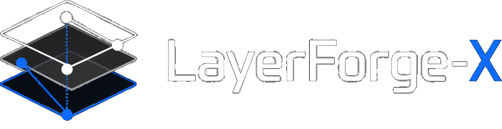

<h1 align="center">LayerForge-<span style="color:#1a7af8;">X</span></h1>

**LayerForge-<span style="color:#1a7af8;">X</span>** decomposes a single RGB image into a depth-aware, semantically grouped, amodal RGBA layer graph.

<p>
  
</p>

## Submission Index and Resources

- **Submission Index:** `docs/SUBMISSION_INDEX.md`
- **Final Report (DOCX):** `docs/final_report_pack/LayerForge_X_Final_Report_2026_04_22.docx`
- **Final Report (PDF):** `docs/final_report_pack/LayerForge_X_Final_Report_2026_04_22.pdf`
- **Final Report (Markdown):** `docs/final_report_pack/LayerForge_X_Final_Report_FULL.md`
- **Canonical Project Manifest:** `PROJECT_MANIFEST.json`
- **Report Artifacts and Metric Snapshots:** `report_artifacts/README.md`
- **Current Results Summary:** `docs/RESULTS_SUMMARY_CURRENT.md`
- **Figure Index:** `docs/FIGURES.md`
- **Public Project Site:** [https://alikestocode.github.io/LayerForge-X-final/](https://alikestocode.github.io/LayerForge-X-final/)
- **Local Browser Interface:** `layerforge webui --open-browser`
- **GitHub Pages Source:** `docs/index.html`

## Visual Documentation and Evidence

The framework provides two primary interfaces for result inspection:

- **Static Documentation Site:** Located in `docs/`, this site facilitates browsing the final report, figures, and reported artifacts.
- **Local Interactive UI:** Accessible via `layerforge webui --open-browser`, this interface allows for real-time image upload and execution of LayerForge decomposition modes.

The following figures provide a comparative analysis of the LayerForge-X pipeline against the Qwen-Image-Layered baseline, alongside specialized prompt-conditioned and transparent-layer extraction tracks.

<p>
  
</p>
<p>
  
</p>
<p>
  
</p>
<p>
  
</p>

### Frontier Performance Metrics (Five-Image Review)

The following table summarizes the performance of LayerForge-X variants against external baselines:

| Method | Mean PSNR | Mean SSIM | Mean Self-Eval | Observations |
|---|---:|---:|---:|---|
| **LayerForge Native** | 37.6688 | 0.9708 | 0.6283 | Highest structural fidelity and selector score |
| LayerForge Peeling | 27.0988 | 0.9096 | 0.4783 | Recursive residual decomposition approach |
| Qwen Raw (4) | 29.0757 | 0.8850 | 0.2541 | Direct Qwen-Image-Layered baseline |
| Qwen + Graph Preserve (4) | 28.5539 | 0.8638 | 0.5259 | Optimized visual order with DALG metadata |
| Qwen + Graph Reorder (4) | 28.5397 | 0.8637 | 0.5251 | Reordered graph-based Qwen stack |

## Project Objectives and Representation

The primary objective of LayerForge-X is defined as follows:

> *Given a single bitmap RGB image, synthesize a set of re-composable RGBA layers characterized by semantic grouping, depth ordering, and optional per-layer intrinsic properties (albedo and shading).*

LayerForge-X formalizes this objective through a **Depth-Aware Amodal Layer Graph (DALG)**:

- **Nodes:** Represent editable RGBA layers, each containing a semantic label, grouping metadata, visible and amodal masks, soft alpha matting, depth statistics, and optional intrinsic layers.
- **Edges:** Encode pairwise occlusion relationships and relative depth evidence between adjacent nodes.
- **Output:** A structured stack ordered from near to far, accompanied by comprehensive diagnostic visualizations and quantitative metrics.

### External Model Enrichment (Qwen-Image-Layered)

Recognizing Qwen-Image-Layered as a significant baseline, LayerForge-X includes an `enrich-qwen` command. This utility imports RGBA layers from external decomposers and augments them with LayerForge-X metadata, including depth ordering, occlusion graphs, amodal completions, and intrinsic decomposition.

## Repository Architecture

```text
configs/
  fast.yaml                  # Deterministic fallback; optimized for low-latency execution
  cutting_edge.yaml          # Advanced ensemble configuration (GroundingDINO, SAM2, multiple depth models)

src/layerforge/
  alpha.py                   # Soft alpha matting and boundary refinement
  benchmark.py               # Framework for synthetic and real-world benchmarking
  cli.py                     # Unified command-line interface
  compose.py                 # Alpha-blending and layer recomposition logic
  dalg.py                    # DALG manifest generation and export
  depth.py                   # Monocular geometry hooks (DepthPro, DepthAnything, Marigold)
  editability.py             # Quantitative editability metrics and target export utilities
  graph.py                   # Graph construction and boundary-weighted ordering algorithms
  inpaint.py                 # Background completion and content-aware inpainting
  intrinsics.py              # Intrinsic decomposition (albedo/shading)
  peeling.py                 # Recursive semantic peeling and effect extraction
  pipeline.py                # Core end-to-end execution pipeline
  qwen_io.py                 # External model integration and enrichment
  ranker.py                  # Learning-based pairwise near/far ranking module
  segment.py                 # Segmentation architectures (Mask2Former, GroundingDINO+SAM2)
  transparent.py             # Transparent foreground recovery and alpha-compositing
  visualize.py               # Diagnostic overlays and visualization tools

scripts/
  collect_run_metrics.py      # Automated metric aggregation and reporting
  export_report_artifacts.py  # Audit-compliant artifact packaging for submissions
  generate_report_figures.py # report-ready comparison panels and graphs
  make_synthetic_dataset.py  # synthetic LayerBench generator
  make_transparent_dataset.py # synthetic transparent benchmark generator
  run_editability_suite.py   # editability-aware follow-up metrics for frontier runs
  run_extract_benchmark.py   # prompt-conditioned extraction benchmark
  run_qwen_image_layered.py  # official Qwen-Image-Layered baseline runner
  run_transparent_benchmark.py # transparent decomposition benchmark
  run_grid.py                # run ablation grids

docs/
  FIGURES.md
  FINAL_PROJECT_SPEC.md
  PRODUCT_ARCHITECTURE_AND_LAUNCH.md
  QWEN_IMAGE_LAYERED_COMPARISON.md
  BENCHMARKING_PROTOCOL_FINAL.md
  NOVELTY_AND_ABLATIONS_FINAL.md
  REPORT_TABLES.md
  api/openapi.yaml
  figures/
  final_report_pack/

schemas/
  dalg.schema.json           # canonical Depth-Aware Amodal Layer Graph schema
```

## Install

```bash
# If you extracted a GitHub archive, the folder is usually LayerForge-X-final-main.
# If you cloned the repo directly, just cd into the repo root.
cd LayerForge-X-final-main
python -m venv .venv
source .venv/bin/activate
python -m pip install --upgrade pip
pip install -e .[dev]
```

Fast mode dependencies live in `requirements.txt`. For model-backed runs (the heavier stuff with Depth Pro, GroundingDINO, SAM2, and friends), install the extras:

```bash
pip install -r requirements-models.txt
```

On Python `3.14`, `simple-lama-inpainting` currently fails to build because of an older Pillow dependency. The repo still works because it falls back to OpenCV inpainting, and the model-backed stack used for the runs in this repo can be installed with:

```bash
pip install torch torchvision transformers accelerate diffusers safetensors
```

## External services and model access

- Gemini-assisted prompt expansion requires `GEMINI_API_KEY`.
- Qwen runs download the public `Qwen/Qwen-Image-Layered` model and therefore need network access plus enough disk space for the checkpoints.
- The model-backed stack is materially heavier than the deterministic fallback. A CUDA GPU is strongly recommended for GroundingDINO, SAM2, Depth Pro, and Qwen.
- Python `3.11` or `3.12` is the safest environment for the full stack. Python `3.14` works for the core repo, but `simple-lama-inpainting` can still fail to build there.

## Fresh-clone verification

From a clean checkout, the shortest complete setup path is:

```bash
python -m venv .venv
source .venv/bin/activate
python -m pip install --upgrade pip
pip install -e .[dev]
pytest -q
```

For a lightweight end-to-end smoke path:

```bash
python scripts/make_synthetic_dataset.py --output examples/synth --count 1

layerforge run \
  --input examples/synth/scene_000/image.png \
  --output runs/smoke \
  --config configs/fast.yaml \
  --segmenter classical \
  --depth geometric_luminance \
  --no-parallax
```

## Browser surfaces

### GitHub Pages project site

The repository includes a static project site rooted at `docs/`. Once GitHub Pages is enabled for the repository, the published entry point is:

```text
https://alikestocode.github.io/LayerForge-X-final/
```

The site is data-driven from the committed manifest and metric snapshots and links directly to the final report, figures, and JSON summaries.

### Local web UI

For a local browser interface that can run the existing Python pipeline on uploaded images:

```bash
layerforge webui --open-browser
```

This starts a lightweight server and opens `webui.html`, where non-CLI users can:

- upload an image,
- choose `run`, `extract`, `transparent`, or `peel`,
- inspect the generated previews,
- open the manifest, metrics, and DALG outputs directly from the browser.

## Fast smoke evaluation

For an end-to-end verification pass without heavyweight checkpoint downloads, use the synthetic generator together with the fast configuration:

```bash
python scripts/make_synthetic_dataset.py --output examples/synth --count 3

layerforge run \
  --input examples/synth/scene_000/image.png \
  --output runs/smoke \
  --config configs/fast.yaml \
  --segmenter classical \
  --depth geometric_luminance \
  --no-parallax
```

For a quick regression gate that stays away from heavyweight model downloads:

```bash
./.venv/bin/pytest -q tests/test_smoke.py tests/test_merge.py tests/test_segment_api.py
```

## Full model-backed run

Once the model extras are installed, the recommended full pipeline invocation is:

```bash
layerforge run \
  --input path/to/image.jpg \
  --output runs/full_image \
  --config configs/best_score.yaml \
  --segmenter grounded_sam2 \
  --depth ensemble \
  --prompts "person,car,truck,chair,table,window,sky,road,tree,animal" \
  --prompt-source augment
```

The current highest-performing native configuration is `configs/best_score.yaml`: ensemble depth, stronger boundary settings, and adaptive merge. The dominant control variable remains the prompt list. For a known scene, curated prompts with `--prompt-source manual` provide the strongest measured performance; for an automated default, `--prompt-source augment` preserves the manual seed classes and adds Gemini-generated extensions.

Measured locally and summarized in the committed report artifacts:

| Run | Layers | PSNR | SSIM |
|---|---:|---:|---:|
| `runs/demo_grounded_depthpro_final` | 45 | 14.6477 | 0.8348 |
| `runs/truck_best_score` | 26 | 30.8214 | 0.9812 |
| `runs/truck_best_score_manual` | 19 | 31.3040 | 0.9813 |
| `runs/truck_best_score_augment` | 19 | 31.1524 | 0.9804 |
| `runs/truck_candidate_search_v2/best` | 20 | 32.1053 | 0.9848 |

These results show that the updated native LayerForge recipe materially improves over the earlier native run in both reconstruction fidelity and stack compactness. In the public repository and submission ZIP, those local runs are represented by the copied summaries under `report_artifacts/metrics_snapshots/`.

## Candidate search

For the strongest native result on a specific image, use the search mode. It runs a small ladder of strong candidates, including manual prompts, augment mode, and Gemini-assisted prompt generation with multiple threshold presets, then keeps the best measured output.

```bash
layerforge autotune \
  --input data/demo/truck.jpg \
  --output runs/truck_candidate_search_v2 \
  --config configs/best_score.yaml \
  --prompts "truck,road,sky,tree,building,window,wheel,car" \
  --device cuda \
  --no-parallax
```

That command writes:

- `runs/truck_candidate_search_v2/search_summary.json`
- `runs/truck_candidate_search_v2/candidates/*`
- `runs/truck_candidate_search_v2/best`

For repository-level auditing, `python scripts/export_report_artifacts.py` also copies the selected summary into `report_artifacts/metrics_snapshots/truck_search_summary.json`.

The current reproducible winner on the truck scene is `manual_precision` at `PSNR 32.1053`, `SSIM 0.9848`, `20` layers.

## Recursive semantic peeling

The repository also includes a recursive decomposition path that peels the frontmost editable entity, inpaints the residual canvas, and iterates until the background is reached.

```bash
layerforge peel \
  --input data/demo/truck.jpg \
  --output runs/truck_recursive_peel \
  --config configs/best_score.yaml \
  --segmenter grounded_sam2 \
  --depth ensemble \
  --prompts "truck,road,sky,tree,building,window,wheel,car" \
  --prompt-source augment \
  --max-layers 6
```

This writes the local working-tree run artifacts:

```text
iterations/iteration_00/input.png
iterations/iteration_00/selected_mask.png
iterations/iteration_00/selected_layer.png
iterations/iteration_00/residual_inpainted.png
layers_effects_rgba/
debug/peeling_strip.png
```

The recursive path is intentionally explicit: each iteration logs the selected layer, the residual image after inpainting, and any associated effect layer recovered from the object-local residual.

## Canonical DALG export

The run manifests in `runs/*/manifest.json` are still useful as engine-level artifacts, but
the product-facing object is now `dalg_manifest.json`: a canonical
Depth-Aware Amodal Layer Graph that normalizes native runs, recursive peeling,
and Qwen/external RGBA enrichment into one design-manifest contract.

Every fresh `run`, `peel`, and `enrich-qwen` invocation now writes:

```text
<run-dir>/
  manifest.json
  dalg_manifest.json
```

You can also regenerate the canonical design manifest for any existing run:

```bash
layerforge export-design \
  --run-dir runs/frontier_review/truck/layerforge_native \
  --output runs/frontier_review/truck/layerforge_native/dalg_manifest.json
```

The schema lives at [schemas/dalg.schema.json](schemas/dalg.schema.json), and the
intended public API contract is captured in [docs/api/openapi.yaml](docs/api/openapi.yaml).
This keeps the product direction explicit: DALG is the system of record, while
PNG stacks, PSD-style folders, and report artifacts are projections of that graph.

## Frontier comparison and self-evaluation

The repository includes a frontier orchestration script that treats native LayerForge, recursive peeling, raw Qwen, and Qwen-hybrid variants as a shared candidate bank, scores the successful candidates per image, and records the highest-scoring editable representation.

```bash
python scripts/run_frontier_comparison.py \
  --inputs data/demo/truck.jpg data/qualitative_pack/astronaut.png \
  --output-root runs/frontier_review \
  --native-config configs/frontier.yaml \
  --peeling-config configs/recursive_peeling.yaml \
  --qwen-layers 4 \
  --qwen-steps 20 \
  --qwen-resolution 640 \
  --qwen-device cuda \
  --qwen-dtype bfloat16 \
  --qwen-offload sequential \
  --skip-existing
```

This writes:

```text
runs/frontier_review/
  frontier_summary.json
  frontier_summary.md
  <image>/
    best_decomposition.json
    why_selected.md
```

The current self-evaluation score is deliberately explicit rather than pretending to be a black-box learned selector. In the committed frontier summary it combines measured recomposition fidelity with editability penalties against copy-like decompositions, semantic separation, alpha quality, and graph confidence. Runtime is currently reserved for future selector tuning because the shipped five-image summary was rescored from cached runs rather than from a fresh timed sweep. Details and caveats are in [docs/FRONTIER_WORKFLOW.md](docs/FRONTIER_WORKFLOW.md).

Measured five-image frontier review, summarized in `report_artifacts/metrics_snapshots/frontier_review_summary.json`:

| Method | Images | Mean PSNR | Mean SSIM | Mean self-eval score | Best-image wins |
|---|---:|---:|---:|---:|---:|
| LayerForge native | 5 | 37.6688 | 0.9708 | 0.6283 | 4 |
| LayerForge peeling | 5 | 27.0988 | 0.9096 | 0.4783 | 0 |
| Qwen raw (4) | 5 | 29.0757 | 0.8850 | 0.2541 | 0 |
| Qwen + graph preserve (4) | 5 | 28.5539 | 0.8638 | 0.5259 | 0 |
| Qwen + graph reorder (4) | 5 | 28.5397 | 0.8637 | 0.5251 | 1 |

Measured interpretation:

- `LayerForge native` remains the highest-scoring representation under the current frontier selector and wins `4/5` images once the anti-trivial editability penalties are enabled;
- `Qwen + graph reorder` is the lone non-native winner in the measured bank, which is a useful reminder that imported generative stacks can still beat the native pipeline on certain compact scenes;
- `LayerForge peeling` remains a real measured row, but the new evaluator no longer lets it win truck just because the recursive path is visually dramatic;
- `Qwen raw` still matters as the compact generative baseline, but it no longer dominates once the comparison includes explicit structure and editability signals.

## Promptable target extraction

The repository exposes promptable target export as a dedicated command rather than requiring the general run path:

```bash
layerforge extract \
  --input data/demo/truck.jpg \
  --output runs/truck_extract \
  --config configs/frontier.yaml \
  --segmenter grounded_sam2 \
  --depth ensemble \
  --prompt "the truck in the foreground"
```

That writes a standard run plus:

- `target_extract/target_rgba.png`
- `target_extract/target_alpha.png`
- `target_extract/background_completed.png`
- `target_extract/edit_preview_move.png`
- `target_extract/target_metadata.json`

Measured prompt benchmark, summarized in `report_artifacts/metrics_snapshots/extract_benchmark_summary.json`, on `10` synthetic LayerBench++ scenes:

| Prompt type | Queries | Target hit rate | Mean target IoU | Mean alpha MAE |
|---|---:|---:|---:|---:|
| text | 10 | 1.0000 | 0.3776 | 0.1503 |
| text + point | 10 | 1.0000 | 0.3776 | 0.1503 |
| text + box | 10 | 1.0000 | 0.3776 | 0.1503 |
| point | 10 | 0.0000 | 0.8654 | 0.0222 |
| box | 10 | 0.0000 | 0.8654 | 0.0222 |

Interpretation:

- text-bearing prompts now hit the intended semantic target on the measured synthetic set;
- point-only and box-only prompts still snap to a highly overlapping neighboring object region, so the IoU is high but the semantic hit rate is correctly `0.0`;
- this is a routing limitation in the current prompt stack, not an alpha-quality collapse.

## Transparent / alpha-composited decomposition

LayerForge-X also exposes a transparent-layer path for semi-transparent overlays, flare-like artifacts, and glass-style composites:

```bash
layerforge transparent \
  --input data/transparent_benchmark/scene_000/input.png \
  --output runs/transparent_demo \
  --config configs/fast.yaml \
  --segmenter classical \
  --depth geometric_luminance \
  --prompt "glass overlay"
```

That writes:

- `transparent_extract/transparent_foreground_rgba.png`
- `transparent_extract/estimated_clean_background.png`
- `transparent_extract/alpha_map.png`
- `transparent_extract/recomposition.png`
- `transparent_extract/transparent_metrics.json`

Measured transparent benchmark, summarized in `report_artifacts/metrics_snapshots/transparent_benchmark_summary.json`, on `12` synthetic scenes:

| Metric | Mean |
|---|---:|
| Transparent alpha MAE | 0.1131 |
| Background PSNR | 25.9863 |
| Background SSIM | 0.9541 |
| Recompose PSNR | 56.0066 |
| Recompose SSIM | 0.9996 |

Transparent recomposition is reported as a sanity check; the primary metrics are alpha error and clean-background quality. This path is still an approximation, not a full generative transparent-layer model, but it now has a measured benchmark instead of only qualitative examples.

## Qwen / external layer enrichment

The idea here is simple: let a generative decomposer produce the initial RGBA layers, then use LayerForge-X to add structure (depth order, occlusion edges, amodal support, intrinsics). First generate layers with Qwen-Image-Layered or another decomposer, drop the PNGs in a folder, and then run:

Export official Qwen layers:

```bash
.venv/bin/python scripts/run_qwen_image_layered.py \
  --input data/demo/truck.jpg \
  --output-dir runs/qwen_truck_layers_raw_640_20 \
  --layers 4 \
  --resolution 640 \
  --steps 20 \
  --device cuda \
  --dtype bfloat16 \
  --offload sequential
```

Then enrich them with LayerForge-X:

```bash
.venv/bin/layerforge enrich-qwen \
  --input data/demo/truck.jpg \
  --layers-dir runs/qwen_truck_layers_raw_640_20 \
  --output runs/qwen_truck_enriched_640_20 \
  --config configs/cutting_edge.yaml \
  --depth depth_pro \
  --preserve-external-order
```

For a stronger enrichment using the cutting-edge config:

```bash
layerforge enrich-qwen \
  --input path/to/original_image.png \
  --layers-dir path/to/qwen_rgba_layers \
  --output runs/qwen_enriched_full \
  --config configs/cutting_edge.yaml \
  --depth depth_pro \
  --preserve-external-order
```

Add `--preserve-external-order` when you want the enriched export to keep the selected external visual stack and only add LayerForge metadata. Leave that flag off when you want the exported stack reordered by the depth graph, subject to the fidelity guardrail that falls back to the selected external stack when graph order is materially worse.

The output directory will contain ordered layers, albedo/shading layers, amodal masks, and a `debug/layer_graph.json` describing the graph structure.

## Submission-safe report artifacts

The heavyweight `runs/`, `results/`, and `data/` directories are local-generation inputs and are omitted from the submission ZIP. To keep the report auditable even when those folders are absent, export a compact artifact pack:

```bash
python scripts/export_report_artifacts.py
```

That writes:

```text
report_artifacts/
  README.md
  command_log.md
  metrics_snapshots/
  figure_sources/figure_manifest.json
```

`PROJECT_MANIFEST.json`, `report_artifacts/metrics_snapshots/*.json`, and `report_artifacts/command_log.md` are the canonical reported artifacts for the repository. The raw benchmark directories are local-generation inputs, not required repository contents.

## Collecting report metrics

To avoid hand-copying numbers into the report tables:

```bash
python scripts/collect_run_metrics.py \
  runs/demo_grounded_depthpro_final \
  runs/truck_best_score \
  runs/truck_best_score_manual \
  runs/truck_best_score_augment \
  runs/truck_candidate_search_v2/best \
  runs/qwen_truck_layers_raw_640_20 \
  runs/qwen_truck_enriched_640_20
```

This prints a compact markdown table from the `metrics.json` files.

## Generating report figures

To regenerate the measured comparison figures used in the report pack:

```bash
python scripts/generate_report_figures.py
```

This full regeneration path requires the local heavyweight `runs/`, `results/`, and `data/` directories. The submission ZIP already includes the generated figure PNGs under `docs/figures/` plus the corresponding audit-safe metric snapshots under `report_artifacts/`.

This writes:

```text
docs/figures/truck_recomposition_comparison.png
docs/figures/truck_layer_stack_comparison.png
docs/figures/truck_metrics_comparison.png
docs/figures/synthetic_ordering_ablation.png
docs/figures/qualitative_gallery.png
docs/figures/frontier_review.png
docs/figures/prompt_extract_benchmark.png
docs/figures/transparent_benchmark.png
docs/figures/effects_layer_demo.png
docs/figures/figure_manifest.json
```

Use `docs/FIGURES.md` as the index of which figure says what.

## Synthetic benchmark

Because real images do not provide ground-truth editable layer stacks, a synthetic benchmark is required for controlled evaluation. Generate one and run the benchmark harness:

```bash
python scripts/make_synthetic_dataset.py --output data/synthetic_layerbench --count 20

layerforge benchmark \
  --dataset-dir data/synthetic_layerbench \
  --output-dir results/synthetic_fast \
  --config configs/fast.yaml \
  --segmenter classical \
  --depth geometric_luminance
```

This writes:

```text
results/synthetic_fast/synthetic_benchmark.csv
results/synthetic_fast/synthetic_benchmark_summary.json
results/synthetic_fast/runs/<scene>/
```

For the richer benchmark artifact format used by the updated report narrative, the generator now has an opt-in `layerbench_pp` mode:

```bash
python scripts/make_synthetic_dataset.py \
  --output data/synthetic_layerbench_pp \
  --count 20 \
  --output-format layerbench_pp \
  --with-effects
```

Each scene then also includes:

```text
visible_masks/
amodal_masks/
alpha_mattes/
layers_effects_rgba/
intrinsics/albedo.png
intrinsics/shading.png
depth.png
depth.npy
occlusion_graph.json
scene_metadata.json
```

The original `basic` mode is still the default so the existing lightweight benchmark path remains reproducible.

### Measured fast-path baseline

The deterministic fallback was actually run on `12` synthetic scenes. The corresponding summary snapshot is `report_artifacts/metrics_snapshots/synthetic_benchmark_summary.json`.

| Split | Segmenter | Depth | Ordering | Mean best IoU | PLOA | Recompose PSNR |
|---|---|---|---|---:|---:|---:|
| synthetic fast | classical | geometric luminance | boundary | 0.1549 | 0.1667 | 19.1360 |

These numbers are intentionally modest. The fast fallback over-segments the synthetic scenes into about `65` layers for `5` ground-truth layers, which makes it useful as a deterministic baseline but not the final story for the report.

## Public real-data benchmarks

The repository includes a real-data evaluator for visible semantic grouping on **COCO Panoptic val2017**. This is a coarse-group benchmark rather than a full panoptic PQ implementation: COCO categories are mapped into the LayerForge groups (`person`, `animal`, `vehicle`, `furniture`, `plant`, `sky`, `road`, `ground`, `building`, `water`, `stuff`, `object`) and scored with dataset-level IoU.

Download the official validation split and panoptic annotations:

```bash
python scripts/download_coco_panoptic_val.py \
  --output-dir data/coco_panoptic_val \
  --archive-dir data/downloads/coco
```

Run the benchmark:

```bash
layerforge benchmark-coco-panoptic \
  --dataset-dir data/coco_panoptic_val \
  --output-dir results/coco_panoptic_mask2former_512 \
  --config configs/fast.yaml \
  --segmenter mask2former \
  --device cuda \
  --max-images 512 \
  --seed 7
```

Measured result in the committed metric snapshots:

| Split | Segmenter | Images | Group mIoU | Thing mIoU | Stuff mIoU | Mean predicted segments |
|---|---|---:|---:|---:|---:|---:|
| COCO Panoptic val2017 sample | mask2former | 512 | 0.5660 | 0.5842 | 0.5479 | 6.45 |

Per-group IoU from `report_artifacts/metrics_snapshots/coco_panoptic_group_benchmark_summary.json`:

| Group | IoU |
|---|---:|
| person | 0.6854 |
| animal | 0.6483 |
| vehicle | 0.6801 |
| furniture | 0.4245 |
| plant | 0.7115 |
| sky | 0.8632 |
| road | 0.3975 |
| ground | 0.4634 |
| building | 0.5785 |
| water | 0.7798 |
| stuff | 0.2048 |
| object | 0.3556 |

This benchmark is intentionally scoped to what COCO can supervise honestly: visible grouping quality. Depth ordering, amodal completion, and intrinsics still need different public datasets.

The repository also includes a second real-data evaluator for **ADE20K SceneParse150 validation**. This uses the same coarse-group IoU protocol as the COCO benchmark, but on a broader scene-parsing dataset with denser indoor/outdoor background supervision. For ADE20K, the strongest measured configuration in the repository is the ADE-tuned Mask2Former setup in [configs/ade20k_mask2former.yaml](configs/ade20k_mask2former.yaml).

Download the official ADE benchmark zip:

```bash
python scripts/download_ade20k.py \
  --output-dir data/ade20k \
  --archive-dir data/downloads/ade20k
```

Run the benchmark:

```bash
layerforge benchmark-ade20k \
  --dataset-dir data/ade20k \
  --output-dir results/ade20k_mask2former_512 \
  --config configs/ade20k_mask2former.yaml \
  --segmenter mask2former \
  --device cuda \
  --max-images 512 \
  --seed 7
```

Measured result in the committed metric snapshots:

| Split | Segmenter | Images | Group mIoU | Thing mIoU | Stuff mIoU | Mean image mIoU | Mean predicted segments |
|---|---|---:|---:|---:|---:|---:|---:|
| ADE20K validation sample | mask2former (ADE) | 512 | 0.6015 | 0.5579 | 0.6451 | 0.5569 | 6.25 |

Per-group IoU from `report_artifacts/metrics_snapshots/ade20k_group_benchmark_summary.json`:

| Group | IoU |
|---|---:|
| animal | 0.3710 |
| building | 0.7757 |
| furniture | 0.6403 |
| ground | 0.5105 |
| object | 0.4669 |
| person | 0.5412 |
| plant | 0.6387 |
| road | 0.8300 |
| sky | 0.8455 |
| stuff | 0.3504 |
| vehicle | 0.6896 |
| water | 0.5585 |

Interpretation:

- COCO and ADE20K are now both covered by the same coarse-group external benchmark path;
- ADE20K is a stronger background/scene-structure benchmark than COCO for this project;
- these public benchmarks validate visible grouping only, while synthetic LayerBench remains the primary controlled benchmark for full-layer metrics such as order and recomposition under known ground truth.

The repository also includes a public depth benchmark on **DIODE validation**. This benchmark complements COCO and ADE20K by evaluating the depth subsystem directly on a public RGB-D dataset with both indoor and outdoor scenes.

Download the official validation tarball:

```bash
python scripts/download_diode_val.py \
  --output-dir data/diode \
  --archive-dir data/downloads/diode
```

Run the honest metric-depth evaluation:

```bash
layerforge benchmark-diode \
  --dataset-dir data/diode \
  --output-dir results/diode_depthpro_full \
  --config configs/diode_depthpro.yaml \
  --depth depth_pro \
  --device cuda \
  --seed 7
```

Run the apples-to-apples relative comparison against the geometric fallback:

```bash
layerforge benchmark-diode \
  --dataset-dir data/diode \
  --output-dir results/diode_geometric_full \
  --config configs/diode_depthpro.yaml \
  --depth geometric_luminance \
  --alignment scale \
  --device cpu \
  --seed 7

layerforge benchmark-diode \
  --dataset-dir data/diode \
  --output-dir results/diode_depthpro_scale_full \
  --config configs/diode_depthpro.yaml \
  --depth depth_pro \
  --alignment scale \
  --device cuda \
  --seed 7
```

Measured full-split results in the committed metric snapshots:

| Variant | Alignment | Images | AbsRel | RMSE | delta1 | SILog |
|---|---|---:|---:|---:|---:|---:|
| geometric luminance | scale | 771 | 0.6298 | 7.0934 | 0.2714 | 184.6629 |
| depth_pro | none | 771 | 0.5230 | 29.0380 | 0.4057 | 26.8766 |
| depth_pro | scale | 771 | 0.3629 | 6.1891 | 0.6452 | 26.8766 |

Indoor/outdoor `AbsRel` split:

| Variant | Alignment | Indoor AbsRel | Outdoor AbsRel |
|---|---|---:|---:|
| geometric luminance | scale | 0.4822 | 0.7373 |
| depth_pro | none | 0.1995 | 0.7588 |
| depth_pro | scale | 0.0880 | 0.5632 |

Interpretation:

- raw `depth_pro` is the honest metric-depth result and is much stronger indoors than outdoors on DIODE;
- for a fair shape-only comparison, scale-aligned `depth_pro` beats the geometric fallback on `AbsRel`, `RMSE`, `delta1`, and `SILog`;
- DIODE now gives the repo a real public depth benchmark, not just synthetic ordering supervision.

## Learned ordering experiment

The repository includes a lightweight pairwise ranker trained on the synthetic benchmark. This enables a comparison between hand-built boundary ordering and a learned near/far scorer without introducing a heavyweight external training stack.

Train the ranker:

```bash
layerforge train-ranker \
  --dataset-dir data/synth_train \
  --output models/order_ranker_fast.json \
  --config configs/fast.yaml \
  --segmenter classical \
  --depth geometric_luminance
```

Run the held-out evaluation:

```bash
layerforge benchmark \
  --dataset-dir data/synth_test \
  --output-dir results/synth_boundary_test \
  --config configs/fast.yaml \
  --segmenter classical \
  --depth geometric_luminance \
  --ordering boundary

layerforge benchmark \
  --dataset-dir data/synth_test \
  --output-dir results/synth_learned_test \
  --config configs/fast.yaml \
  --segmenter classical \
  --depth geometric_luminance \
  --ordering learned \
  --ranker-model models/order_ranker_fast.json
```

Held-out comparison:

| Split | Ordering | Mean best IoU | PLOA | Recompose PSNR |
|---|---|---:|---:|---:|
| synth test | boundary | 0.1549 | 0.1667 | 19.1589 |
| synth test | learned ranker | 0.1549 | 0.1667 | 19.4138 |

Interpretation: the learned ranker improves recomposition PSNR by about `+0.255` dB on held-out synthetic scenes, but it does not improve pairwise layer-order accuracy yet because the classical proposal stage still over-segments aggressively. That is a good, honest ablation result to report.

## Main outputs

Every run (whether `run`, `enrich-qwen`, or a per-scene benchmark run) produces the same set of artifacts:

```text
layers_ordered_rgba/       # near → far layer stack
layers_grouped_rgba/       # semantic/depth grouped layers
layers_albedo_rgba/        # per-layer albedo approximation
layers_shading_rgba/       # per-layer shading approximation
layers_amodal_masks/       # estimated amodal support masks
debug/depth_gray.png
debug/segmentation_overlay.png
debug/layer_graph.json
debug/background_completion.png
debug/parallax_preview.gif
manifest.json
metrics.json
```

## Final project thesis

LayerForge-X is not positioned as a replacement for Qwen-Image-Layered. Qwen remains a strong generative RGB→RGBA baseline. LayerForge-X instead provides an interpretable, depth-aware, benchmarked layer representation with explicit near/far ordering, occlusion edges, amodal support, intrinsic appearance factors, and component-level evaluation.

Accordingly, Qwen is used as:

1. a baseline to compare against,
2. a proposal source when its generative layers are better than classical segmentation,
3. a hybrid partner: Qwen layers + LayerForge graph enrichment.

This comparative framing matches the measured evidence in the repository and keeps the project claims aligned with the current frontier.

To make the multi-image comparison reproducible rather than ad hoc, the repository includes:

```bash
python scripts/run_curated_comparison.py \
  --input-dir data/qualitative_pack \
  --output-root runs/curated_comparison \
  --native-config configs/cutting_edge.yaml \
  --native-segmenter grounded_sam2 \
  --native-depth depth_pro \
  --qwen-layers 3,4,6,8
```

This writes a per-image comparison tree covering native LayerForge, raw Qwen, `Qwen + graph preserve`, and `Qwen + graph reorder`, plus aggregate `comparison_summary.json` and `comparison_summary.md`.

Measured five-image `3/4/6/8` Qwen sweep, summarized in `runs/qwen_five_image_review/comparison_summary.{json,md}` and copied into `report_artifacts/metrics_snapshots/qwen_five_image_review_summary.json`:

| Row | Mean PSNR | Mean SSIM |
|---|---:|---:|
| Qwen raw (3) | 29.7574 | 0.8874 |
| Qwen raw (4) | 29.0757 | 0.8850 |
| Qwen raw (6) | 29.1079 | 0.8800 |
| Qwen raw (8) | 27.1419 | 0.8663 |
| Qwen + graph preserve (3) | 29.2311 | 0.8663 |
| Qwen + graph preserve (4) | 28.5539 | 0.8638 |
| Qwen + graph preserve (6) | 28.6464 | 0.8588 |
| Qwen + graph preserve (8) | 26.7452 | 0.8444 |
| Qwen + graph reorder (3) | 29.2263 | 0.8663 |
| Qwen + graph reorder (4) | 28.5397 | 0.8637 |
| Qwen + graph reorder (6) | 28.6964 | 0.8586 |
| Qwen + graph reorder (8) | 26.7543 | 0.8443 |

Measured interpretation:

- `Qwen raw (3)` is the strongest compact pure-fidelity setting on the shipped five-image bank, with `Qwen raw (6)` close behind;
- `Qwen + graph preserve` stays relatively stable through `3/4/6` layers and remains the cleaner metadata-first comparison row;
- `Qwen + graph reorder` now stays numerically competitive at `6/8` because the new fidelity guardrail falls back to the selected external stack when graph order is clearly worse; on the measured five-image bank that guardrail triggers for `3/5` six-layer runs and `4/5` eight-layer runs, so the deeper reorder rows should be read as mixed graph-order and guarded-fallback exports rather than as pure graph-order success.

## Public benchmark roadmap

The current public-benchmark status and the planned dataset extensions are tracked in [docs/PUBLIC_BENCHMARKS.md](docs/PUBLIC_BENCHMARKS.md).
