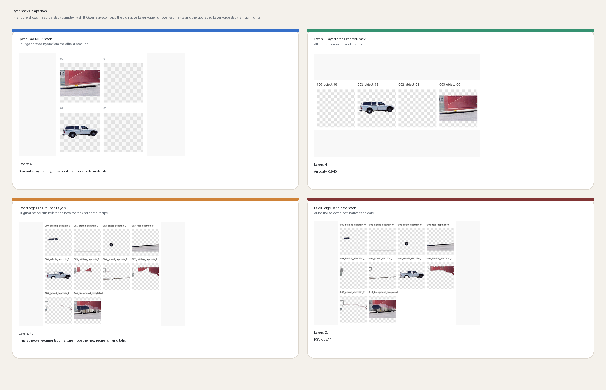
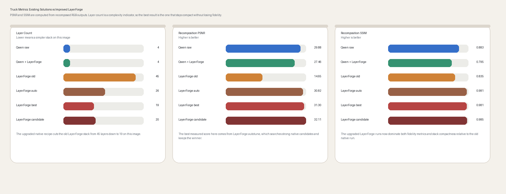
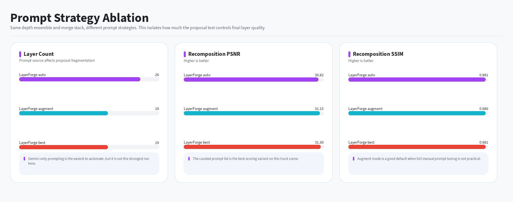
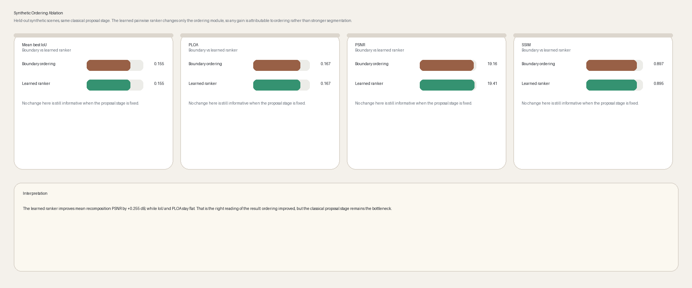
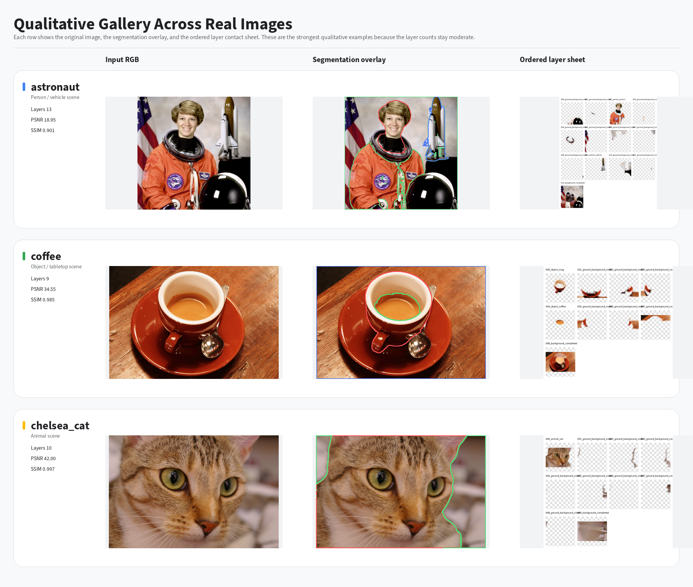
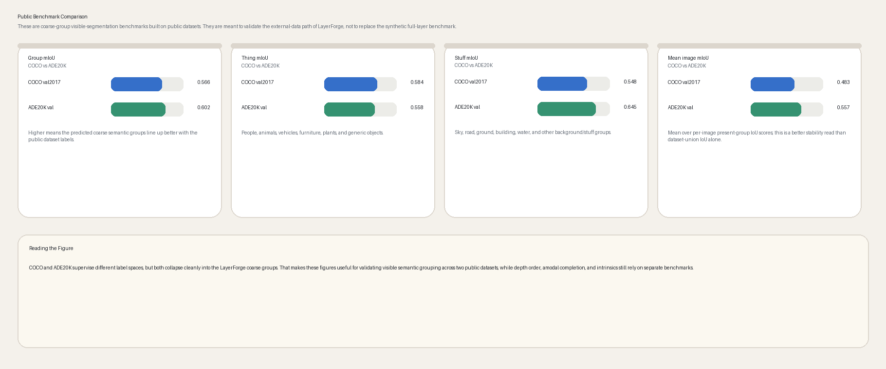
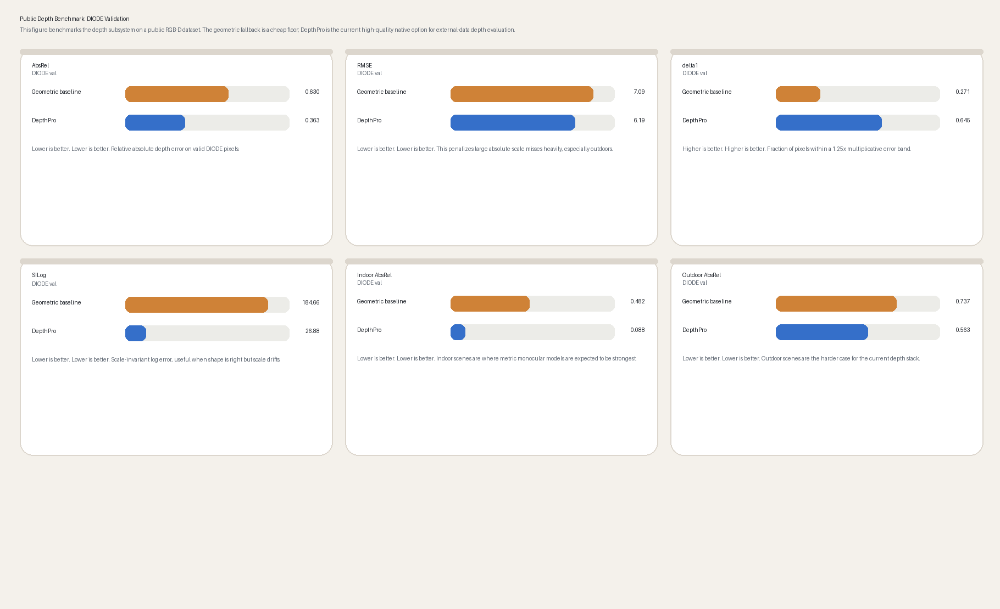

# LayerForge-X Final Report

## Abstract

Single-image editing systems increasingly need structured scene representations rather than a flat RGB bitmap or a folder of visible cutouts. LayerForge-X addresses that need by exporting a **Depth-Aware Amodal Layer Graph (DALG)**: ordered RGBA layers with semantic grouping, soft alpha, occlusion metadata, optional amodal support, background completion, intrinsic appearance factors, and editability-oriented diagnostics. The system combines native decomposition, Qwen/external RGBA enrichment, recursive peeling, and explicit self-evaluation so different candidate representations can be compared under one graph contract. This report focuses on the measured behavior of those components, the benchmark protocol used to evaluate them, and the practical limits that still separate the current implementation from fully generative layered scene understanding.

## 1. Introduction

The core goal is not just to decompose an image, but to convert it into an **editable scene asset**. That requires more than segmentation. A useful representation needs explicit near-to-far ordering, soft alpha boundaries, at least heuristic amodal support, some notion of hidden/background completion, and export surfaces that support real editing workflows. LayerForge-X therefore treats the scene graph as the canonical object and regards PNG stacks, debug artifacts, and design-manifest exports as projections of that graph.

## 2. Contributions

This report makes five concrete claims:

1. LayerForge-X implements a depth-aware amodal layer graph rather than a simple bag of masks.
2. The repo includes a fair Qwen comparison with preserve/reorder hybrid modes and a common evaluation frame.
3. Recursive peeling is implemented as a measured alternative path rather than only a conceptual extension.
4. The evaluation stack now includes anti-trivial editability metrics, not only recomposition fidelity.
5. The system exports a canonical DALG manifest and a product-facing design-manifest projection suitable for future API/editor integration.

## 3. Figures

### Truck recomposition comparison

### Truck layer stack comparison

### Truck metrics comparison

### Prompt ablation

### Synthetic ordering ablation

### Qualitative gallery

### Associated-effect demo

### Frontier review

### Prompt extraction benchmark

### Transparent benchmark

### Public visible-group benchmark comparison

### Public depth benchmark comparison

## 4. Current measured summary

### Report tables snapshot

The current table templates and measured cells live in [../REPORT_TABLES.md](../REPORT_TABLES.md).

### Current measured-results snapshot

The current measured-results narrative lives in [../RESULTS_SUMMARY_2026_04_19.md](../RESULTS_SUMMARY_2026_04_19.md).

### Qwen comparison notes

The direct Qwen baseline and hybrid positioning live in [../QWEN_IMAGE_LAYERED_COMPARISON.md](../QWEN_IMAGE_LAYERED_COMPARISON.md).

### Final measured additions (2026-04-22)

Five-image Qwen raw versus hybrid review:

| Method | Images | Graph | Mean PSNR | Mean SSIM |
|---|---:|---|---:|---:|
| LayerForge native | 5 | yes | 27.3438 | 0.9464 |
| Qwen raw (4) | 5 | no | 29.0757 | 0.8850 |
| Qwen + LayerForge graph preserve (4) | 5 | yes | 28.5539 | 0.8638 |
| Qwen + LayerForge graph reorder (4) | 5 | yes | 28.5397 | 0.8637 |

Associated-effect demo:

| Artifact | Effect detected | Predicted effect px | Ground-truth effect px | Effect IoU |
|---|---|---:|---:|---:|
| `runs/effects_groundtruth_demo_cutting_edge` | yes | 4853 | 13750 | 0.3529 |

Five-image frontier candidate-bank review:

| Method | Images | Mean PSNR | Mean SSIM | Mean self-eval score | Best-image wins |
|---|---:|---:|---:|---:|---:|
| LayerForge native | 5 | 37.6688 | 0.9708 | 0.6283 | 4 |
| LayerForge peeling | 5 | 27.0988 | 0.9096 | 0.4783 | 0 |
| Qwen raw (4) | 5 | 29.0757 | 0.8850 | 0.2541 | 0 |
| Qwen + graph preserve (4) | 5 | 28.5539 | 0.8638 | 0.5259 | 0 |
| Qwen + graph reorder (4) | 5 | 28.5397 | 0.8637 | 0.5251 | 1 |

Five-image editability suite:

| Method | Remove response | Move response | Recolor response | Edit success | Non-edit preservation | Background hole ratio |
|---|---:|---:|---:|---:|---:|---:|
| LayerForge native | 0.1097 | 0.1011 | 0.1220 | 0.6695 | 0.9999 | 0.4860 |
| LayerForge peeling | 0.1019 | 0.0808 | 0.1082 | 0.5865 | 1.0000 | 0.5433 |
| Qwen raw (4) | 0.0002 | 0.0001 | 0.0001 | 0.1506 | 1.0000 | 1.0000 |
| Qwen + graph preserve (4) | 0.2083 | 0.1509 | 0.1421 | 0.8633 | 0.9887 | 0.1420 |
| Qwen + graph reorder (4) | 0.2080 | 0.1491 | 0.1421 | 0.8607 | 0.9886 | 0.1427 |

Interpretation:

- raw Qwen remains the stronger compact pure-PSNR baseline on the measured five-image sweep;
- native LayerForge now has the strongest mean SSIM on the same images, at the cost of a much larger stack;
- the measured frontier candidate bank now selects `LayerForge native` for `4/5` images, with `Qwen + graph reorder` winning the cat scene;
- the `Qwen + graph preserve` row is the fair metadata-first hybrid comparison because it keeps the interpreted Qwen stack and adds graphs, ordering metadata, amodal masks, and intrinsic artifacts;
- the editability suite now acts as the anti-triviality guardrail for the frontier selector, which is why raw Qwen's object-removal response stays near zero despite reasonable recomposition scores;
- the associated-effect path now has a real exported demo artifact with a materially improved clean-reference rerun, but it still must be framed as an early heuristic rather than a solved component.

Promptable extraction benchmark:

| Prompt type | Queries | Target hit rate | Mean target IoU | Mean alpha MAE |
|---|---:|---:|---:|---:|
| text | 10 | 1.0000 | 0.3776 | 0.1503 |
| text + point | 10 | 1.0000 | 0.3776 | 0.1503 |
| text + box | 10 | 1.0000 | 0.3776 | 0.1503 |
| point | 10 | 0.0000 | 0.8654 | 0.0222 |
| box | 10 | 0.0000 | 0.8654 | 0.0222 |

Transparent benchmark:

| Metric | Mean |
|---|---:|
| Transparent alpha MAE | 0.1131 |
| Background PSNR | 25.9863 |
| Background SSIM | 0.9541 |
| Recompose PSNR | 56.0066 |
| Recompose SSIM | 0.9996 |

Interpretation:

- promptable extraction is now a measured component instead of only a CLI feature;
- text-bearing prompts currently carry the semantic routing load, while point-only and box-only prompts still need better disambiguation;
- transparent decomposition is now a benchmarked prototype path and should be framed as an approximate alpha-composited recovery mode rather than a solved generative transparent-layer model.

## 5. Limitations and failure cases

Failure taxonomy and future-work framing are documented in [04_ABLATIONS_AND_TABLES.md](04_ABLATIONS_AND_TABLES.md) and [02_BENCHMARKING_PROTOCOL.md](02_BENCHMARKING_PROTOCOL.md). The report should explicitly keep:

- wrong semantic grouping;
- wrong depth order;
- jagged alpha boundaries;
- missing shadow/effect layers;
- bad inpainting in large unseen regions;
- bad amodal continuation under heavy occlusion;
- intrinsic split errors.

## 6. Remaining review checklist

The repo-level acceptance checklist lives in [../NEXT_REVIEW_CHECKLIST_2026_04_22.md](../NEXT_REVIEW_CHECKLIST_2026_04_22.md).

## Appendix A: report source map

Primary source files for the report narrative:

- [01_LITERATURE_REVIEW_ADVANCED.md](01_LITERATURE_REVIEW_ADVANCED.md)
- [02_BENCHMARKING_PROTOCOL.md](02_BENCHMARKING_PROTOCOL.md)
- [03_NOVELTY_AND_METHOD.md](03_NOVELTY_AND_METHOD.md)
- [04_ABLATIONS_AND_TABLES.md](04_ABLATIONS_AND_TABLES.md)
- [../RESULTS_SUMMARY_2026_04_19.md](../RESULTS_SUMMARY_2026_04_19.md)
- [../QWEN_IMAGE_LAYERED_COMPARISON.md](../QWEN_IMAGE_LAYERED_COMPARISON.md)

## Appendix B: full source sections

The following sections are appended verbatim so the DOCX contains the current report text even if markdown files continue evolving independently.

\newpage

<!-- include: 01 -->

\newpage

<!-- include: 02 -->

\newpage

<!-- include: 03 -->

\newpage

<!-- include: 04 -->
