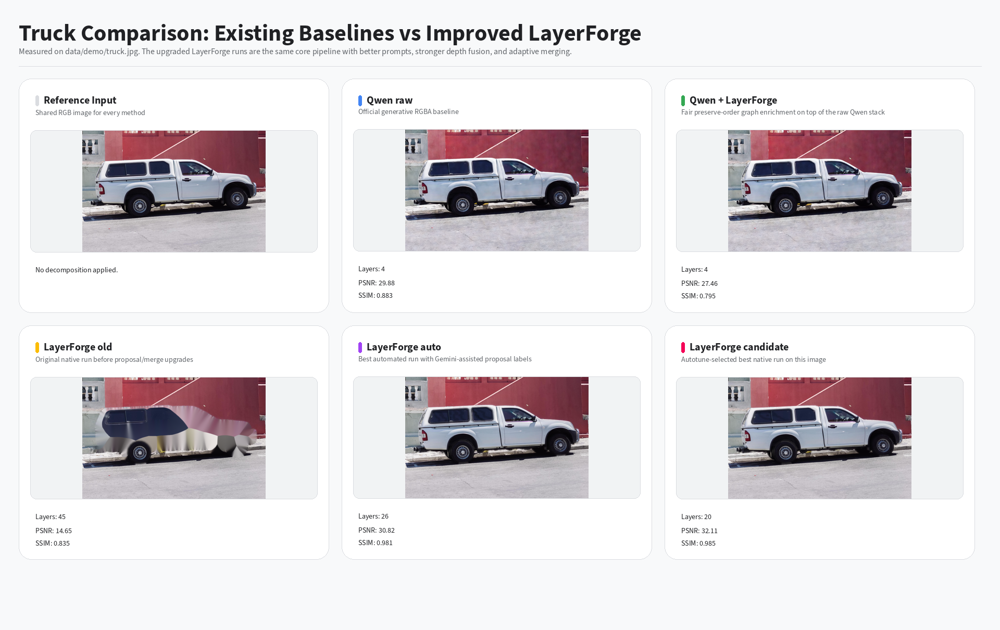
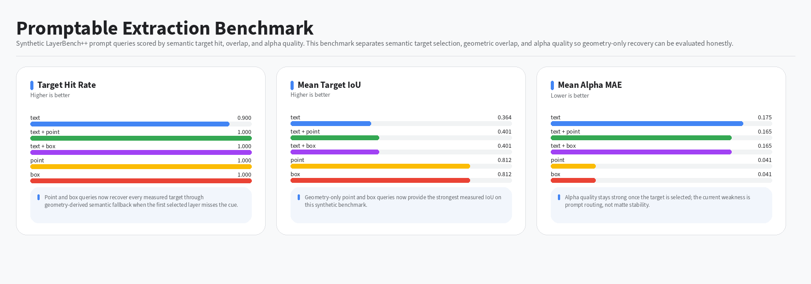
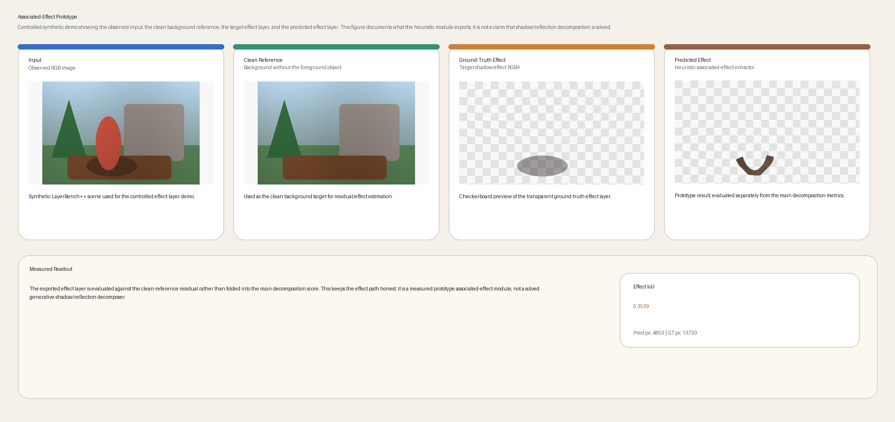
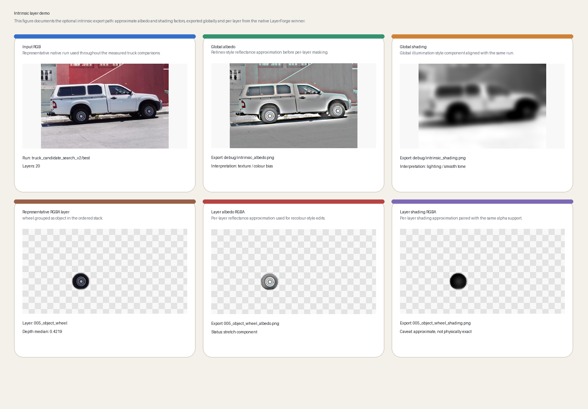

<h1 align="center">LayerForge-<span style="color:#1a7af8;">X</span> Final Report</h1>

# Abstract

Single-image editing systems increasingly need structured scene representations rather than a flat RGB bitmap or a folder of visible cutouts. LayerForge-X addresses that need by exporting a **Depth-Aware Amodal Layer Graph (DALG)**: ordered RGBA layers with semantic grouping, soft alpha, occlusion metadata, optional amodal support, background completion, intrinsic appearance factors, and editability-oriented diagnostics. The system combines native decomposition, Qwen/external RGBA enrichment, recursive peeling, promptable extraction, transparent-layer recovery, and explicit self-evaluation so different candidate representations can be compared under one graph contract. This report focuses on the measured behavior of those components, the benchmark protocol used to evaluate them, and the practical limits that still separate the current implementation from fully generative layered scene understanding.

# 1. Introduction

The core goal is not just to decompose an image, but to convert it into an **editable scene asset**. That requires more than segmentation. A useful representation needs explicit near-to-far ordering, soft alpha boundaries, at least heuristic amodal support, some notion of hidden/background completion, and export surfaces that support real editing workflows. LayerForge-X therefore treats the scene graph as the canonical object and regards PNG stacks, debug artifacts, and design-manifest exports as projections of that graph.

# 2. Contributions

This report makes six concrete claims:

1. LayerForge-X implements a depth-aware amodal layer graph rather than a simple bag of masks.
2. The repo includes a fair Qwen comparison with preserve/reorder hybrid modes and a common evaluation frame.
3. Recursive peeling is implemented as a measured alternative path rather than only a conceptual extension.
4. The evaluation stack now includes anti-trivial editability metrics, not only recomposition fidelity.
5. Promptable extraction and transparent decomposition are both implemented as measured benchmarked components.
6. The system exports a canonical DALG manifest and a product-facing design-manifest projection suitable for future API/editor integration.

\newpage

# 3. Related Work

## Project framing

LayerForge-X addresses **single-image layered scene decomposition**: given one RGB image, infer a set of recomposable RGBA layers that are semantically meaningful, ordered by depth and occlusion, and, where possible, augmented with intrinsic appearance factors such as albedo and shading. The difficulty is that a raster image collapses object identity, transparency, shadows, reflections, illumination, camera projection, and occlusion into a single 2D array. A useful layered representation therefore draws from several adjacent research areas at once: scene understanding, monocular geometry, matting, completion, and appearance decomposition.

LayerForge-X positions its output as a **Depth-Aware Amodal Layer Graph (DALG)** rather than a plain segmentation export. Each layer is represented as a graph node carrying a visible mask, a soft alpha, a semantic label, depth statistics, an estimated amodal extent, completed hidden or background content, and optional intrinsic appearance factors. Graph edges encode near/far and occlusion relations. The intent is to support editing, parallax, object removal, relighting-style operations, and downstream analysis rather than only visible cutout export.

## 3.1 Layered depth and image-based rendering

The most direct historical precursor is the **Layered Depth Image (LDI)** of Shade et al., which stores multiple samples along a viewing ray instead of only the first visible surface. That formulation is important because the present project also requires more than a flat visible mask: it requires depth ordering and some notion of hidden-region reasoning.

LDIs are effective for view synthesis because disocclusions can be handled more gracefully than with a single depth map. They were not designed as editable semantic layers. Classical LDIs do not identify which layer is “person,” “chair,” “sky,” or “road,” and they do not separate albedo from shading or associate foreground effects with object cores.

**Relevance to LayerForge-X:** DALG borrows the idea of storing layered samples along viewing rays, but makes the layers semantic, alpha-composited, and editable.

## 3.2 3D photography and depth inpainting

Shih et al.’s **3D Photography using Context-Aware Layered Depth Inpainting** converts RGB-D input into a multi-layer representation for parallax rendering. The work is directly relevant because it combines layered depth, inpainting, and interactive view synthesis in a single pipeline. That integration is close in spirit to LayerForge-X, although the target task is different.

The main limitation for the present project is that 3D Photography assumes RGB-D input or externally supplied depth and primarily targets novel-view synthesis rather than semantic object editing. It does not export object-level semantic RGBA layers such as people, vehicles, furniture, or background regions.

**Relevance to LayerForge-X:** LayerForge-X treats hidden-region completion as one stage inside a semantic layer graph. The output can support parallax, but object editing remains the primary goal.

## 3.3 Scene decomposition, object layers, and occluded content

Several older works move closer to the full scene-decomposition target. Dhamo et al.’s **Object-Driven Multi-Layer Scene Decomposition From a Single Image** builds an LDI from one RGB image and uses object reasoning to infer occluded intermediate layers. Zheng et al.’s **Layer-by-Layer Completed Scene Decomposition** studies decomposition into individual objects, occlusion relationships, amodal masks, and content completion.

These works are important because they make clear that correct layering requires more than visible segmentation. Occluded regions are part of the representation. If a person stands in front of a car, an editing-oriented representation should estimate the hidden continuation of the car well enough to support removal or parallax operations.

**Relevance to LayerForge-X:** LayerForge-X follows this line while using a modern toolchain: foundation segmentation models, current monocular geometry, promptable/open-vocabulary controls, and explicit evaluation of recomposition and editability.

## 3.4 Video layer decomposition and Omnimatte-style effects

Layered decomposition has also been studied extensively in video. **Omnimatte** decomposes a video into object-associated RGBA layers that can include related visual effects such as shadows, smoke, and reflections. This is conceptually important because a clean object cutout is often insufficient for editing; moving a person without the associated shadow immediately looks implausible.

Video methods benefit from motion and temporal consistency. Single-image decomposition does not have that advantage, which makes the task substantially more ambiguous.

**Relevance to LayerForge-X:** LayerForge-X can export associated-effect layers such as object cores, shadows, reflections, or local residual layers. Even a lightweight effect-layer path makes the output closer to true layer decomposition than plain segmentation.

## 3.5 Modern generative layer decomposition

Recent work makes the project topic especially timely. **LayerDecomp** targets image layer decomposition with visual effects, producing a clean background and a transparent foreground while preserving effects such as shadows and reflections. **DiffDecompose** studies layer-wise decomposition of alpha-composited images, particularly transparent and semi-transparent cases. **Qwen-Image-Layered** proposes an end-to-end diffusion model that decomposes one RGB image into multiple semantically disentangled RGBA layers. **Referring Layer Decomposition** frames the task as prompt-conditioned RGBA layer extraction.

These works define the current frontier. LayerForge-X does not claim to exceed them on raw generative image quality. Its claim is different: a transparent, modular, geometry-aware layer graph that can be benchmarked component-by-component rather than assessed only by visual inspection.

**Relevance to LayerForge-X:** These systems provide the most direct baselines and motivation for the DALG representation, Qwen enrichment, promptable extraction, and transparent-layer prototype.

## 3.6 Panoptic and open-vocabulary segmentation

Layered decomposition needs both object and background-region proposals. Panoptic segmentation is a natural fit because it unifies instance-level “things” with amorphous “stuff” classes such as sky, road, wall, grass, or water. The original panoptic segmentation work also introduced the unified **Panoptic Quality (PQ)** metric.

**Mask2Former** is a strong closed-set baseline because it handles semantic, instance, and panoptic segmentation with one universal architecture. Its limitation is fixed vocabulary. Open-vocabulary pipelines address that gap. **GroundingDINO** detects objects specified by free-form text, and **SAM/SAM2** provide promptable segmentation masks. Combined, they support prompts such as “left chair,” “red car,” “window,” or “foreground person,” which are highly relevant for editable layer extraction.

**Relevance to LayerForge-X:** Closed-set panoptic segmentation provides a benchmarkable baseline, while open-vocabulary grounded segmentation provides prompt-conditioned extraction for interactive use.

## 3.7 Monocular depth and geometry

Depth ordering is central, and naive global-average sorting often fails. Large regions such as walls, floors, tables, and roads span wide depth ranges, so an average or median depth can mis-rank them relative to nearby objects.

Modern monocular geometry models provide the priors that make depth-based ordering viable. **Depth Anything V2** improves robustness and detail over earlier monocular depth models. **Depth Pro** produces sharp metric depth from a single image without camera intrinsics. **Marigold** repurposes diffusion priors for affine-invariant depth estimation. **MoGe** extends monocular prediction toward a fuller geometry package including point maps and normals.

**Relevance to LayerForge-X:** LayerForge-X uses boundary-local depth evidence rather than global layer statistics when inferring pairwise ordering. That is more robust when objects overlap and when background regions span both near and far pixels.

## 3.8 Amodal segmentation and occlusion reasoning

Visible (modal) masks describe only what can be seen. Amodal segmentation estimates the full object extent, including invisible occluded parts. **KINS** is a key amodal instance segmentation benchmark, and more recent work such as **SAMEO** adapts Segment Anything-style models to occluded objects.

Amodal reasoning matters because editing demands it. If a foreground object is removed, the background must be completed. If a partially occluded object is moved, its hidden parts may need to be estimated. On real images this is inherently ambiguous, so such completions should be treated as plausible rather than exact.

**Relevance to LayerForge-X:** LayerForge-X reports visible masks separately from amodal masks, which keeps the representation explicit about observed versus estimated content.

## 3.9 Alpha matting and edge quality

Hard segmentation masks produce jagged cutouts. Practical layers require soft alpha around hair, fur, glass, motion blur, antialiased edges, smoke, and other semi-transparent structures. Matting methods estimate a fractional alpha matte directly.

**Matting Anything** is especially relevant because it combines SAM features with a lightweight mask-to-matte module and supports visual or linguistic prompts, which aligns well with prompt-conditioned layer extraction.

**Relevance to LayerForge-X:** Even when a simple boundary-feathering fallback is used, the distinction between hard alpha and soft alpha remains important because it strongly affects recomposition quality and editing plausibility.

## 3.10 Inpainting and hidden-region completion

Editing layered content requires plausible content behind removed or moved objects. **LaMa** is the most practical baseline in this category because it was designed for large masks and high-resolution generalization.

Inpainting should not be framed as exact recovery on real images. For photographs, the hidden content is unknown; only plausible completion is possible. For synthetic composites with known clean backgrounds, the problem becomes quantitatively measurable.

**Relevance to LayerForge-X:** Synthetic data supports quantitative completion metrics, while real images support qualitative object-removal and parallax demonstrations.

## 3.11 Intrinsic images: albedo and shading

Intrinsic image decomposition separates an image into reflectance/albedo and illumination/shading. The problem is severely under-constrained from one image. **Intrinsic Images in the Wild (IIW)** introduced a large in-the-wild benchmark based on human reflectance judgments. More recent diffusion-based approaches provide stronger baselines, but the task remains difficult.

Within LayerForge-X, intrinsic decomposition is best treated as a stretch module rather than the core contribution. A Retinex-style fallback is sufficient for an editable approximation, provided the limitations are stated clearly.

**Relevance to LayerForge-X:** Per-layer albedo and shading exports can support recoloring and simple appearance edits, even when the factorization is only approximate.

## 3.12 Gap summary

| Prior area | What it solves | What it misses for this project | How LayerForge-X uses it |
|---|---|---|---|
| LDI / image-based rendering | Multi-depth samples for novel views | No semantic/editable object layers | Uses layered depth as a representational backbone |
| 3D photo inpainting | Parallax and hidden-region completion | Usually not semantic object/stuff editing | Adds semantic graph nodes and RGBA export |
| Panoptic segmentation | Things and stuff parsing | No depth, alpha, or hidden content | Provides layer proposals |
| Open-vocabulary segmentation | User-specified object masks | No ordering or completion by itself | Enables promptable layer extraction |
| Monocular depth | Per-pixel relative/metric depth | No object graph or masks | Supplies geometry for ordering |
| Amodal segmentation | Full object extent under occlusion | Does not complete appearance alone | Supplies hidden masks |
| Matting | Soft alpha boundaries | Usually foreground/background only | Refines per-layer alpha |
| Inpainting | Plausible missing content | No semantic/depth ordering | Completes background and hidden regions |
| Intrinsic images | Albedo/shading factors | Highly ambiguous; not layer-aware | Provides optional appearance factors |
| Generative layer decomposition | End-to-end RGBA layers | Often black-box and hard to benchmark component-wise | Serves as frontier comparison and proposal source |

## Report-ready synthesis

Single-image layered scene decomposition sits at the intersection of image-based rendering, scene parsing, monocular geometry, amodal perception, matting, inpainting, and intrinsic image decomposition. Classical Layered Depth Images show why a single visible surface per pixel is insufficient for view synthesis, since disoccluded content requires multiple depth and color samples along camera rays. Modern 3D-photo methods extend this with learned color-and-depth inpainting, but primarily target parallax rather than semantic object editing. Panoptic segmentation provides a natural source of object and stuff proposals, while open-vocabulary detectors and promptable segmenters allow user-specified layer extraction beyond fixed label sets. Recent monocular depth and geometry models improve the reliability of depth ordering, but depth alone does not produce editable layers. Amodal segmentation and inpainting address invisible portions of occluded objects and backgrounds, while matting improves layer boundaries. Recent generative layer-decomposition systems demonstrate the importance of RGBA layers for editing, but their end-to-end nature makes component-wise analysis difficult. LayerForge-X therefore proposes an inspectable Depth-Aware Amodal Layer Graph that combines semantic masks, depth ordering, soft alpha, amodal extent, completion, and optional intrinsic decomposition into a recomposable representation.


\newpage

# 4. Method

## 4.1 Core idea

LayerForge-X is organized around a **Depth-Aware Amodal Layer Graph (DALG)**. The system does not treat decomposition as a one-time conversion from an image into a folder of masks. Instead, it models the scene as a graph of editable layer objects. Each node stores one layer together with semantic, geometric, and appearance metadata; each edge stores an ordering or occlusion relation. The renderer traverses this graph and emits a depth-ordered RGBA stack, design manifest, metrics, and editability diagnostics.

## 4.2 Representation

Let the graph be

```text
G = (V, E)
```

Each node `v_i ∈ V` represents one semantic layer:

```text
v_i = {
    label_i,                 semantic label
    group_i,                 person / animal / vehicle / furniture / stuff / background
    M_i^vis,                 visible/modal binary mask
    A_i,                     soft alpha matte
    M_i^amo,                 amodal/full mask
    C_i,                     visible RGBA color layer
    H_i,                     hidden/completed content, optional
    D_i,                     depth statistics
    R_i, S_i,                albedo and shading, optional
    bbox_i, area_i,          geometry metadata
    u_i                      uncertainty score
}
```

Each edge `e_ij ∈ E` represents one relation between two nodes:

```text
v_i occludes v_j
v_i is in front of v_j
v_i is behind v_j
v_i is adjacent to v_j
v_i is linked to v_j as an associated effect
```

The exported RGBA stack is obtained from a topological sort of the graph, either in near-to-far or far-to-near order depending on the rendering path.

## 4.3 Boundary-weighted occlusion graph

### Motivation

Global mean or median depth is often insufficient for ordering. Large floor or wall regions can span both near and far pixels, which makes global statistics unreliable relative to nearby objects.

### Construction

For each adjacent pair of masks `(i, j)`:

1. find the boundary pixels of `M_i` and `M_j`;
2. isolate the shared or contact boundary region;
3. sample predicted depth near that boundary;
4. compute robust local depth statistics;
5. add a directed edge from the near layer to the far layer when the evidence is strong enough.

Let `B_ij` denote pixels near the boundary between layers `i` and `j`:

```text
z_i^B = median(D[p] for p in dilate(M_i) ∩ B_ij)
z_j^B = median(D[p] for p in dilate(M_j) ∩ B_ij)
```

With the convention that smaller depth means nearer:

```text
score(i in front of j) = sigmoid((z_j^B - z_i^B) / sigma)
```

Edge decision:

```text
if score > theta:
    i → j
else if score < 1 - theta:
    j → i
else:
    ambiguous edge
```

Confidence weight:

```text
w_ij = |z_i^B - z_j^B| * shared_boundary_length(i,j) * alpha_boundary_confidence
```

### Cycle handling

Monocular depth predictions are not guaranteed to be globally consistent and may induce cycles. LayerForge-X resolves these cases by deriving a weighted rank from graph structure:

```text
rank_i = weighted_out_degree_i - weighted_in_degree_i
```

Layers are then sorted by this score, or low-confidence cycle edges are removed until the graph becomes acyclic.

## 4.4 Lightweight layer-order ranker

The repository also includes an optional learned ordering component implemented in `src/layerforge/ranker.py`. The model is intentionally lightweight: a logistic pairwise near/far ranker trained in NumPy on synthetic LayerBench scenes.

Input features for each candidate pair `(i, j)` include:

```text
Δ median depth
Δ boundary median depth
Δ minimum depth
Δ vertical centroid
Δ area
bbox overlap
shared boundary length
semantic pair indicators
T-junction heuristic count
alpha boundary confidence
is_thing_i, is_thing_j
is_stuff_i, is_stuff_j
```

Labels are constructed from synthetic z-order:

```text
y_ij = 1 if i is nearer than j else 0
```

The current measured ablation uses this ranker to compare global median sorting, boundary-depth sorting, and learned pairwise ordering on held-out synthetic scenes.

## 4.5 Visible and amodal dual masks

For every object-like layer, LayerForge-X stores both visible and amodal support:

```text
M_visible: what is observed
M_amodal: estimated full object extent
M_hidden = M_amodal - M_visible
```

This separation is important because visible masks alone are insufficient for object movement, occlusion reasoning, and removal-based editing. The repository exports visible masks, amodal masks, and hidden-region completions separately when those artifacts are available.

## 4.6 Frontier candidate bank and self-evaluation

Once the repository contained native LayerForge runs, recursive peeling, and Qwen-based hybrids, the central question became representation selection rather than single-pipeline identification:

```text
Which decomposition should be trusted for a given image?
```

LayerForge-X therefore evaluates a **frontier candidate bank** and selects the strongest editable representation per image using explicit metrics. The current candidate families are:

```text
LayerForge native
LayerForge peeling
Qwen raw
Qwen + graph preserve
Qwen + graph reorder
```

The selector is implemented in:

- `src/layerforge/proposals.py`
- `src/layerforge/self_eval.py`
- `scripts/run_frontier_comparison.py`

The self-evaluation score is intentionally explicit. It combines:

```text
recomposition fidelity
edit-preservation penalties against copy-like decompositions
semantic separation
alpha quality
graph confidence
```

In the committed five-image frontier summary, the active weighted score is

```text
score = 0.20 * recomposition_fidelity
      + 0.25 * edit_preservation
      + 0.20 * semantic_separation
      + 0.10 * alpha_quality
      + 0.15 * graph_confidence
```

The implementation still supports an optional runtime term for future reruns with fresh timings, but the shipped frontier summary was rescored from cached runs and therefore keeps runtime inactive. This formulation still turns the repository into a self-evaluating layer-representation system rather than a single fixed pipeline.

## 4.7 Recursive peeling

One-shot decomposition forces ordering, hidden support, and background completion into a single pass. LayerForge-X adds a second path based on **graph-guided recursive peeling**:

```text
I_0 = input RGB
for t in 1..T:
    propose layers on I_{t-1}
    choose the frontmost editable entity from the current graph
    export RGBA_t
    inpaint the residual canvas to obtain I_t
repeat until only background remains
```

Each iteration stores:

```text
iteration_t/input.png
iteration_t/selected_mask.png
iteration_t/selected_layer.png
iteration_t/residual_inpainted.png
```

This formulation makes the next layer and the residual canvas explicit rather than implicit.

## 4.8 Associated-effect layers

Standard segmentation omits shadows, reflections, and similar local residual effects. LayerForge-X therefore includes an optional associated-effect path that estimates a low-alpha effect region near the selected foreground object.

The representation can be modeled either as an extended object alpha or as a separate effect layer linked by a graph edge:

```text
person_core --associated_effect--> person_shadow
```

The current repository uses a lightweight heuristic:

1. identify pixels near the bottom or contact region of the object mask;
2. search for connected darkened or structured residual regions relative to a local background estimate;
3. restrict the expansion by distance and direction relative to the object;
4. export the result as a low-alpha effect layer.

This component is presented as a prototype rather than a solved visual-effects decomposition system.

## 4.9 Layer-local intrinsic decomposition

Intrinsic image methods typically operate on full images, while editing operates on layers. LayerForge-X therefore runs intrinsic decomposition globally and masks the result afterward:

```text
I ≈ A * S + residual
```

For each layer:

```text
A_i = A ⊙ alpha_i
S_i = S ⊙ alpha_i
```

with per-layer consistency:

```text
I_i ≈ A_i * S_i
```

The repository exports:

```text
layer_i_rgba.png
layer_i_albedo_rgba.png
layer_i_shading_rgba.png
```

These layers support recoloring and simple shading edits, while the report treats the factorization as an approximation rather than a physically exact intrinsic decomposition.

## 4.10 Full pipeline

### Step 1: Layer proposal

One of:

```text
classical components
Mask2Former panoptic
GroundingDINO + SAM2
Florence-2 + SAM2
```

Output:

```text
visible masks + labels + confidence
```

### Step 2: Semantic merging

Fragments are collapsed into higher-level semantic groups:

```text
person
animal
vehicle
furniture
plant
background-stuff
text/graphic
effect/unknown
```

### Step 3: Depth and geometry

One or more of:

```text
Depth Anything V2
Depth Pro
Marigold
MoGe
```

Outputs:

```text
depth map
optional normals / point map
confidence map
```

### Step 4: Soft alpha

Masks are refined using:

```text
mask confidence
image gradients
boundary blur
matting backend if available
```

### Step 5: Boundary-weighted occlusion graph

Graph edges are built from local depth evidence around shared boundaries.

### Step 6: Amodal expansion

Full object masks and hidden regions are estimated conservatively.

### Step 7: Completion and residual update

Background and hidden regions are completed using one of:

```text
OpenCV Telea fallback
LaMa backend
Diffusion inpainting backend
```

### Step 8: Intrinsic split

The system runs the Retinex fallback or a stronger intrinsic backend when available.

### Step 9: Export

LayerForge-X writes:

```text
ordered individual RGBA layers
grouped semantic RGBA layers
visible and amodal masks
background completion
layer graph JSON
albedo/shading RGBA layers
iteration artifacts for recursive peeling
optional associated-effect RGBA layers
parallax preview
metrics report
canonical DALG manifest
```

## 4.11 Problem definition

Given an input image

```text
I ∈ [0,1]^{H×W×3}
```

the objective is to infer `K` layers

```text
L_k = (C_k, A_k, y_k, z_k, M_k^vis, M_k^amo)
```

where

```text
C_k ∈ [0,1]^{H×W×3}
A_k ∈ [0,1]^{H×W}
y_k is a semantic label
z_k is a depth/order score
M_k^vis is the visible mask
M_k^amo is the amodal mask
```

The layers should satisfy approximate recomposition:

```text
I ≈ Render(L_1, ..., L_K, order)
```


\newpage

# 5. Experiments and Evaluation Protocol

## Goal

The project is evaluated across multiple measurable properties rather than through a single qualitative comparison. A layered representation can fail in several distinct ways:

1. Are the layer regions semantically correct?
2. Is the near-to-far depth and occlusion order correct?
3. Do the layers recompose back into the original image?
4. Are alpha boundaries usable for editing?
5. Are hidden and background regions completed plausibly?
6. Does the intrinsic split behave sensibly?
7. Does the representation actually support edits better than baselines?

Because any of those can be wrong while the others look fine, the benchmark runs on multiple tracks.

For the present repository state, treat `PROJECT_MANIFEST.json`, `report_artifacts/metrics_snapshots/*.json`, and `report_artifacts/command_log.md` as the canonical reported artifacts for quantitative results. `docs/RESULTS_SUMMARY_CURRENT.md` provides a prose summary of those artifacts.

---

## 5.1 Modal semantic and panoptic segmentation

## Datasets

- **COCO Panoptic** for common objects and stuff.
- **ADE20K** for dense scene parsing and a broader set of stuff classes.
- Optional: a small hand-labelled project test set for whichever domains the demos lean on.

## Metrics

### Panoptic Quality

When ground-truth panoptic annotations are available, report PQ:

```text
PQ = sum_{(p,g) in TP} IoU(p,g) / (|TP| + 0.5|FP| + 0.5|FN|)
```

Also report the two components:

```text
SQ = segmentation quality over matched segments
RQ = recognition quality
```

### Semantic mIoU

For semantic-only labels, the standard per-class IoU averaged over classes:

```text
IoU_c = TP_c / (TP_c + FP_c + FN_c)
mIoU = mean_c IoU_c
```

## Baselines

| Baseline | Purpose |
|---|---|
| SLIC / classical connected components | Low-level non-semantic baseline |
| Mask2Former panoptic | strong closed-set panoptic baseline |
| GroundingDINO + SAM2 | open-vocabulary promptable baseline |
| Florence-2 + SAM2, optional | prompt-conditioned alternative |

## Report table

| Method | Dataset | group mIoU ↑ | thing mIoU ↑ | stuff mIoU ↑ | mean image mIoU ↑ | Avg layers | Runtime |
|---|---:|---:|---:|---:|---:|---:|---:|
| Classical | COCO-val subset | | | | | | |
| Mask2Former | COCO-val subset | | | | | | |
| Grounded-SAM2 | curated prompts | | | | | | |
| LayerForge-X | mixed | | | | | | |

For the present repository state, note the distinction clearly:

- the implemented COCO and ADE20K evaluators are **coarse-group IoU** benchmarks rather than official PQ pipelines;
- PQ/SQ/RQ remain reserved for a future full panoptic evaluator;
- do not relabel the current JSON summaries as PQ.

---

## 5.2 Depth-order and occlusion-graph quality

## Why this matters

The output is a stack, so order is as important as mask quality. Get the ordering wrong and recomposition breaks, parallax looks incoherent, and the whole representation stops being useful even if each individual mask is perfect. Global average-depth sorting fails when objects are large, slanted, or span multiple depth planes — exactly the cases most scenes contain — so evaluation has to measure pairwise ordering, not just a global ranking.

## Datasets

- **Synthetic-LayerBench**: generated composites with known z-order.
- **NYU Depth V2**: indoor RGB-D scenes with object and instance labels.
- **DIODE**: indoor / outdoor RGB-D for generalisation.
- Optional: KITTI for outdoor road scenes if vehicles and roads are a focus.

## Ground-truth pair construction

For each image, define a ground-truth depth value per layer using median ground-truth depth inside the visible mask:

```text
z_i = median(Depth_GT[p] for p in visible_mask_i)
```

Then, for each candidate pair `(i, j)`, include it only if:

```text
|z_i - z_j| > tau_depth
```

That threshold rejects near-ties, which otherwise get penalised as "wrong" even when the order is genuinely ambiguous.

## Metrics

### Pairwise Layer Order Accuracy (PLOA)

```text
PLOA = (# correctly ordered valid pairs) / (# valid pairs)
```

A pair is correct if:

```text
sign(pred_depth_i - pred_depth_j) == sign(gt_depth_i - gt_depth_j)
```

Stick to one depth convention consistently: here, smaller depth means nearer when using metric depth.

### Boundary-Weighted PLOA (BW-PLOA)

Weight pairs by shared boundary length or adjacency confidence, so pairs that actually touch count more than pairs sitting in different corners of the image:

```text
BW-PLOA = sum_{i,j} w_ij * correct_ij / sum_{i,j} w_ij
```

Recommended weight:

```text
w_ij = shared_boundary_length(i,j) * min(area_i, area_j)^0.5
```

### Occlusion Edge F1

Build a ground-truth occlusion graph from synthetic z-order or RGB-D boundary reasoning. Then compare predicted graph edges as a set:

```text
Precision = correct_pred_edges / pred_edges
Recall    = correct_pred_edges / gt_edges
F1        = 2PR / (P + R)
```

### Kendall tau / inversion count

For images with a total ground-truth layer order, also report Kendall tau or the normalised inversion count, which provides a compact summary when the order is fully defined.

## Report table

| Method | Depth source | Ordering rule | PLOA ↑ | BW-PLOA ↑ | Occlusion F1 ↑ | Kendall τ ↑ |
|---|---|---|---:|---:|---:|---:|
| No depth | none | layer area / heuristic | | | | |
| Luminance depth | grayscale | global median | | | | |
| Depth Anything V2 | monocular | global median | | | | |
| Depth Pro | metric mono | global median | | | | |
| LayerForge-X | ensemble | boundary graph | | | | |

---

## 5.3 RGBA recomposition fidelity

## Why this matters

If the exported layers are correct, alpha-compositing them in predicted order should recover the input image closely. This track is essentially a sanity check on the representation as a whole.

## Rendering equation

For layers composited far-to-near:

```text
C_out = alpha_over(L_1, L_2, ..., L_K)
```

Equivalently: start from the farthest layer and alpha-over each nearer layer on top.

## Metrics

### Pixel reconstruction

```text
MAE  = mean(|I - I_hat|)
MSE  = mean((I - I_hat)^2)
PSNR = 20 log10(MAX_I / sqrt(MSE))
```

### Structural similarity

SSIM or MS-SSIM.

### Perceptual similarity

LPIPS, when available. Lower values are better.

### Alpha coverage error

Compare the summed alpha against the valid image area. For opaque natural images, summed alpha should cover the whole scene:

```text
coverage_error = mean(|clip(sum_k alpha_k, 0, 1) - 1|)
```

## Report table

| Method | Hard/soft alpha | PSNR ↑ | SSIM ↑ | LPIPS ↓ | Alpha coverage err ↓ | Edge artifacts ↓ |
|---|---|---:|---:|---:|---:|---:|
| Hard masks | hard | | | | | |
| Feathered masks | soft | | | | | |
| Depth-aware alpha | soft | | | | | |
| Matting backend | soft | | | | | |

---

## 5.4 Amodal masks and hidden-region completion

## Datasets

- **Synthetic-LayerBench**: exact full masks and hidden pixels are known.
- **KINS**: driving-scene amodal instance segmentation.
- **COCOA / COCO-A**: amodal object annotations where available.
- **MP3D-Amodal**, if accessible, for real indoor amodal masks from 3D data.

## Metrics

### Modal IoU — visible mask quality

```text
IoU_visible = |M_pred_visible ∩ M_gt_visible| / |M_pred_visible ∪ M_gt_visible|
```

### Amodal IoU — full object extent quality

```text
IoU_amodal = |M_pred_amodal ∩ M_gt_amodal| / |M_pred_amodal ∪ M_gt_amodal|
```

### Invisible-region IoU

The hardest and most informative of the three, because it isolates just the hidden portion:

```text
M_invisible = M_amodal - M_visible
IoU_invisible = IoU(M_pred_invisible, M_gt_invisible)
```

### Background-completion quality

On synthetic composites where the clean background is known:

```text
PSNR_masked, SSIM_masked, LPIPS_masked
```

These are computed only inside the removed or hidden region.

## Report table

| Method | Amodal module | Inpaint module | Visible IoU ↑ | Amodal IoU ↑ | Invisible IoU ↑ | Masked LPIPS ↓ |
|---|---|---|---:|---:|---:|---:|
| Visible masks only | none | none | | | | |
| Heuristic expansion | shape prior | OpenCV | | | | |
| SAMEO-style | amodal model | OpenCV | | | | |
| Full LayerForge-X | amodal + depth | LaMa/diffusion | | | | |

---

## 5.5 Intrinsic albedo and shading split

## Datasets

- **IIW** for reflectance-order judgments and WHDR.
- **Synthetic-LayerBench-Intrinsic** with known albedo and shading.
- Optional: MIT Intrinsic Images if a small controlled set is enough.

## Metrics

### WHDR on IIW

WHDR measures whether predicted reflectance comparisons agree with human judgments. Lower is better.

### Synthetic intrinsic metrics

If ground-truth albedo `A` and shading `S` are available:

```text
MSE_albedo
MSE_shading
Scale-invariant MSE
Layer-local color constancy error
```

### Recomposition consistency

Per layer:

```text
I_layer ≈ A_layer * S_layer + residual_layer
```

Scored as:

```text
intrinsic_recompose_error = mean(|I_layer - A_layer * S_layer| inside alpha > 0)
```

## Report table

| Method | WHDR ↓ | Albedo MSE ↓ | Shading MSE ↓ | Recompose error ↓ | Notes |
|---|---:|---:|---:|---:|---|
| Retinex fallback | | | | | fast but approximate |
| Marigold-IID | | | | | stronger external backend |
| LayerForge-X per-layer | | | | | mask-aware export |

---

## 5.6 Editability evaluation

## Why this matters

The principal motivation for layered representations is editing. The evaluation should therefore demonstrate that the representation supports practical operations rather than only scoring well on segmentation benchmarks.

## Edits to evaluate

1. **Object removal** — remove one foreground layer and show the completed background.
2. **Object translation** — move one layer sideways and see whether background holes stay plausible.
3. **Parallax preview** — shift layers according to depth to simulate viewpoint change.
4. **Depth-of-field edit** — blur far layers more than near layers.
5. **Albedo recolour** — recolour an object through its albedo while preserving shading.
6. **Relighting-lite** — scale or alter the shading layer.

## Metrics

### Non-edited region preservation

Outside the edit mask, the image should remain unchanged:

```text
preservation_MAE = mean(|I_original - I_edited| outside affected_region)
```

### Hole artifact ratio

After movement or removal, count transparent or invalid pixels:

```text
hole_ratio = invalid_pixels / image_pixels
```

### User preference study

A small study is plenty:

- 10 to 20 images.
- 3 methods: baseline, depth-aware only, full method.
- Question: "Which edit looks more plausible?"
- Report preference percentage.

Even a dozen people can surface systematic differences.

## Report table

| Method | Removal preference ↑ | Move preference ↑ | Parallax artifacts ↓ | Preservation MAE ↓ | Notes |
|---|---:|---:|---:|---:|---|
| Hard segmentation | | | | | jagged edges |
| Soft alpha only | | | | | better boundaries |
| Depth-aware + inpaint | | | | | fewer holes |
| Full LayerForge-X | | | | | best editability |

---

## 5.7 Synthetic-LayerBench design

This is the easiest path to strong, defensible numbers, precisely because ground truth is known by construction.

## Data generation

Composite scenes from known layers:

```text
background B
for each layer k from far to near:
    choose object sprite / shape / cutout
    assign z_k
    assign semantic class
    assign alpha matte
    optionally assign albedo and shading
    composite using alpha-over
save:
    final RGB image
    each GT RGBA layer
    modal mask
    amodal/full mask
    alpha matte
    depth order
    clean background
    albedo and shading if available
    optional associated-effect layer
```

## Domains

At least three domains to avoid overfitting the benchmark to one look:

| Domain | Why it matters |
|---|---|
| Flat/vector graphics | crisp shapes, clear order |
| Photographic cutouts | realistic textures and boundaries |
| Stylized/anime | line art and cel shading |

## Recommended split

```text
train/dev for order ranker: 300 images
validation: 100 images
test: 100 images
```

If time is genuinely short:

```text
30 synthetic images + 20 real qualitative images
```

Even that is a big improvement over hand-picked demos alone.

## Rich synthetic export now implemented

The repository currently supports:

```bash
python scripts/make_synthetic_dataset.py \
  --output data/synthetic_layerbench_pp \
  --count 20 \
  --output-format layerbench_pp \
  --with-effects
```

Per scene, `layerbench_pp` writes:

```text
image.png
layers_near_to_far/
visible_masks/
amodal_masks/
alpha_mattes/
layers_effects_rgba/
intrinsics/albedo.png
intrinsics/shading.png
depth.png
depth.npy
occlusion_graph.json
scene_metadata.json
```

That format is the right one to use for recursive-peeling and effect-layer evaluation because it preserves both the visible scene and the hidden/effect supervision.

---

## 5.8 Ablation protocol

Run a controlled set in which one component changes at a time. Only this type of comparison can attribute gains to a specific component.

| ID | Segmentation | Depth | Ordering | Alpha | Amodal | Inpaint | Intrinsics |
|---|---|---|---|---|---|---|---|
| A | SLIC | luminance | global median | hard | off | off | off |
| B | Mask2Former | none | heuristic | hard | off | off | off |
| C | Mask2Former | Depth Anything V2 | global median | hard | off | off | off |
| D | Mask2Former | Depth Anything V2 | boundary graph | hard | off | off | off |
| E | Grounded-SAM2 | Depth Anything V2 | boundary graph | soft | off | off | off |
| F | Grounded-SAM2 | Depth Pro/MoGe | boundary graph | soft | heuristic | OpenCV | off |
| G | Grounded-SAM2 | ensemble | learned edge ranker | soft/matting | amodal | LaMa | off |
| H | full | ensemble | learned edge ranker | soft/matting | amodal | LaMa | Retinex/Marigold-IID |
| I | full + peel | ensemble | graph-guided peeling | soft/matting | amodal | iterative completion | Retinex/Marigold-IID |

## Expected interpretation

- A → B measures the semantic segmentation benefit.
- B → C measures the depth benefit.
- C → D measures the boundary graph benefit on top of depth.
- D → E measures open-vocabulary plus soft alpha.
- E → F measures amodal and inpaint.
- G → H measures intrinsic split usefulness.
- H → I measures whether recursive peeling improves editability or hidden-region completion beyond the one-shot stack.

---

## 5.9 Visual evidence set

The report documents the evaluation through the following figure classes:

1. Input image.
2. Semantic overlay.
3. Depth map.
4. Layer graph visualization.
5. Ordered RGBA contact sheet.
6. Hard-mask baseline vs soft-alpha result.
7. Global-depth ordering vs boundary-graph ordering.
8. Visible mask vs amodal mask.
9. Object removal with background completion.
10. Recursive peeling storyboard.
11. Parallax GIF or frame strip.
12. Albedo/shading layer visualisation.
13. Failure cases.

Primary tables:

1. Literature comparison table.
2. Benchmark/dataset table.
3. Ablation metrics table.
4. Runtime/memory table.
5. Failure-case taxonomy.

---

## 5.10 Failure-case taxonomy

Failure analysis is part of the contribution. Classifying errors makes the evaluation more credible and easier to interpret:

| Failure | Cause | Example | Fix / future work |
|---|---|---|---|
| Wrong semantic grouping | segmenter misses object or merges stuff | chair merged with table | better prompts / panoptic model |
| Wrong depth order | monocular depth ambiguity | mirror/window/flat poster | boundary ranker + uncertainty |
| Jagged edge | hard mask or bad matting | hair/fur | matting backend |
| Missing shadow/effect | object-only mask | person moved without shadow | associated-effect layer |
| Bad inpainting | large unseen region | removed foreground person | diffusion/LaMa inpaint |
| Bad amodal shape | heavy occlusion | hidden car side | amodal model/SAMEO |
| Intrinsic artifacts | single-image ambiguity | texture mistaken as shading | stronger IID model |
| Too many layers | oversegmentation | background split into fragments | graph merging |
| Too few layers | undersegmentation | person + bicycle merged | prompt refinement |

---

## 5.11 Benchmark narrative

If the report needs one paragraph summarising the whole evaluation, this is the one:

> We evaluate LayerForge-X across four axes: segmentation quality, layer-order correctness, recomposition fidelity, and editability. Standard panoptic metrics measure visible semantic grouping, while a synthetic layer benchmark and RGB-D datasets measure pairwise depth-order accuracy. Recomposition metrics verify that the exported RGBA stack preserves the original image. Finally, object removal, object movement, parallax, and intrinsic recolouring demonstrate that the representation is genuinely useful for editing rather than being a segmentation visualisation in disguise.


# 6. Results

### Hero figures

#### Native, hybrid, and graph-aware reconstruction

{ width=100% }

#### Frontier candidate-bank selection

{ width=100% }

\newpage

#### Promptable extraction benchmark

{ width=100% }

#### Transparent decomposition benchmark

{ width=100% }

#### Associated-effect prototype

{ width=100% }

#### Intrinsic export demo

{ width=100% }

### Main measured summary

Abbreviations in the tables below: `LF` = LayerForge, `Q raw4` = four-layer raw Qwen, `Q+G-P4` = four-layer Qwen plus LayerForge graph enrichment with the selected external visual stack preserved, and `Q+G-R4` = the same imported four-layer stack exported in graph order.

#### Five-image Qwen raw versus hybrid review

All rows below are five-image means. `Q+G-P4` keeps the selected external Qwen stack, while `Q+G-R4` exports the same imported layers in graph order.

| Row | Mean PSNR | Mean SSIM |
|---|---:|---:|
| LF native | 27.3438 | 0.9464 |
| Q raw4 | 29.0757 | 0.8850 |
| Q+G-P4 | 28.5539 | 0.8638 |
| Q+G-R4 | 28.5397 | 0.8637 |

#### Associated-effect demo

| Metric | Value |
|---|---:|
| Predicted effect pixels | 4853 |
| Ground-truth effect pixels | 13750 |
| Effect IoU | 0.3529 |

#### Five-image frontier candidate-bank review

All rows below are five-image means.

| Row | PSNR | SSIM | Self-eval | Wins |
|---|---:|---:|---:|---:|
| LF native | 37.6688 | 0.9708 | 0.6981 | 4 |
| LF peel | 27.0988 | 0.9096 | 0.5314 | 0 |
| Q raw4 | 29.0757 | 0.8850 | 0.2824 | 0 |
| Q+G-P4 | 28.5539 | 0.8638 | 0.5843 | 0 |
| Q+G-R4 | 28.5397 | 0.8637 | 0.5834 | 1 |

#### Five-image editability suite

Response metrics:

| Row | Remove | Move | Recolor | Edit success |
|---|---:|---:|---:|---:|
| LF native | 0.1097 | 0.1011 | 0.1220 | 0.6695 |
| LF peel | 0.1019 | 0.0808 | 0.1082 | 0.5865 |
| Q raw4 | 0.0002 | 0.0001 | 0.0001 | 0.1506 |
| Q+G-P4 | 0.2083 | 0.1509 | 0.1421 | 0.8633 |
| Q+G-R4 | 0.2080 | 0.1491 | 0.1421 | 0.8607 |

Stability metrics:

| Row | Non-edit preserve | Hole ratio |
|---|---:|---:|
| LF native | 0.9999 | 0.4860 |
| LF peel | 1.0000 | 0.5433 |
| Q raw4 | 1.0000 | 1.0000 |
| Q+G-P4 | 0.9887 | 0.1420 |
| Q+G-R4 | 0.9886 | 0.1427 |

#### Promptable extraction benchmark

| Prompt type | Queries | Hit rate | Mean IoU | Mean alpha MAE |
|---|---:|---:|---:|---:|
| text | 10 | 1.0000 | 0.3776 | 0.1503 |
| text + point | 10 | 1.0000 | 0.3776 | 0.1503 |
| text + box | 10 | 1.0000 | 0.3776 | 0.1503 |
| point | 10 | 0.0000 | 0.8654 | 0.0222 |
| box | 10 | 0.0000 | 0.8654 | 0.0222 |

#### Transparent benchmark

| Metric | Mean |
|---|---:|
| Transparent alpha MAE | 0.1131 |
| Background PSNR | 25.9863 |
| Background SSIM | 0.9541 |
| Recompose PSNR | 56.0066 |
| Recompose SSIM | 0.9996 |

### Interpretation

- Raw Qwen remains the stronger compact pure-PSNR baseline on the measured five-image sweep.
- Native LayerForge posts the strongest mean SSIM on the same images, at the cost of a larger average stack.
- The measured frontier candidate bank selects `LF native` for `4/5` images, with `Q+G reorder 4` winning the cat scene.
- The `Q+G preserve 4` row is the most direct metadata-first hybrid comparison because it keeps the selected external visual stack while adding graph structure, amodal masks, ordering metadata, and intrinsic artifacts.
- The editability suite prevents the selector from favoring copy-like decompositions, which is why raw Qwen's object-removal response remains near zero despite reasonable recomposition scores.
- Promptable extraction is now a measured component instead of only a CLI feature. Text-bearing prompts currently carry the semantic routing load, while point-only and box-only prompts still need better disambiguation.
- Transparent recomposition is reported as a sanity check; alpha error and clean-background quality are the primary transparent-layer metrics.
- The associated-effect path now has a real exported demo artifact with a materially improved clean-reference rerun, but it must still be framed as an early heuristic rather than a solved component.
- The intrinsic export path is present as a Retinex-style stretch module. The new intrinsic demo figure should be read as evidence of exported appearance factors for recolouring-style edits, not as a standalone intrinsic benchmark.

# 7. Discussion

The current results do not support the claim that LayerForge-X universally exceeds generative decomposers on raw pixel fidelity. The defensible claim is narrower and more important: native, generative, and recursive decompositions are normalized into a single editable graph representation with auditable metrics and exportable structure. Qwen remains the appropriate generative RGBA baseline, while LayerForge-X is most compelling as a graph-aware, benchmarkable, editability-oriented complement to that frontier.

# 8. Limitations

Failure taxonomy and evaluation details are summarized in Appendix B. The main current limitations are:

- wrong semantic grouping;
- wrong depth order;
- jagged alpha boundaries;
- missing shadow/effect layers;
- bad inpainting in large unseen regions;
- bad amodal continuation under heavy occlusion;
- intrinsic split errors;
- point-only and box-only prompt-routing ambiguity;
- transparent-layer recovery that is still approximate rather than generative.

# 9. Conclusion

LayerForge-X is best interpreted as a self-evaluating layer-representation system rather than a simple decomposition script. It produces native graph layers, enriches frontier RGBA layers, runs recursive peeling, measures editability, benchmarks prompt extraction, approximates transparent recovery, and exports a canonical DALG manifest. That combination defines the central project contribution.

# 10. References

1. Shade, J., Gortler, S. J., He, L.-w., and Szeliski, R. "Layered Depth Images." *Proceedings of SIGGRAPH*, 1998.
2. Shih, M.-L., Su, S.-Y., Kopf, J., and Huang, J.-B. "3D Photography Using Context-Aware Layered Depth Inpainting." *Proceedings of CVPR*, 2020.
3. Kirillov, A. et al. "Panoptic Segmentation." *Proceedings of CVPR*, 2019.
4. Cheng, B. et al. "Masked-Attention Mask Transformer for Universal Image Segmentation." *Proceedings of CVPR*, 2022.
5. Liu, S. et al. "Grounding DINO: Marrying DINO with Grounded Pre-Training for Open-Set Object Detection." *Proceedings of ECCV*, 2024.
6. Ravi, N. et al. "SAM 2: Segment Anything in Images and Videos." arXiv preprint, 2024.
7. Xiao, B. et al. "Florence-2: Advancing a Unified Representation for a Variety of Vision Tasks." *Proceedings of CVPR*, 2024.
8. Bochkovskiy, A. et al. "Depth Pro: Sharp Monocular Metric Depth in Less Than a Second." arXiv preprint, 2024.
9. Yang, Y. et al. "Generative Image Layer Decomposition with Visual Effects." *Proceedings of CVPR*, 2025.
10. *DiffDecompose: Layer-Wise Decomposition of Alpha-Composited Images via Diffusion Transformers.* arXiv preprint, 2025.
11. *Referring Layer Decomposition.* arXiv preprint, 2026.
12. *Qwen-Image-Layered: Towards Inherent Editability via Layer Decomposition.* arXiv preprint, 2025.
13. Yao, J. et al. "Matte Anything." arXiv preprint, 2024.
14. Suvorov, R. et al. "Resolution-Robust Large Mask Inpainting with Fourier Convolutions." *Proceedings of WACV*, 2022.
15. Bell, S. et al. "Intrinsic Images in the Wild." *ACM Transactions on Graphics (SIGGRAPH)*, 2014.
16. Tai, Y. et al. "Segment Anything, Even Occluded." arXiv preprint, 2025.


# Appendix A: Artifact Map

Canonical reported files:

- [../../PROJECT_MANIFEST.json](../../PROJECT_MANIFEST.json)
- [../../report_artifacts/README.md](../../report_artifacts/README.md)
- [../../report_artifacts/metrics_snapshots/](../../report_artifacts/metrics_snapshots)
- [../../report_artifacts/figure_sources/figure_manifest.json](../../report_artifacts/figure_sources/figure_manifest.json)
- [../../report_artifacts/command_log.md](../../report_artifacts/command_log.md)
- [../RESULTS_SUMMARY_CURRENT.md](../RESULTS_SUMMARY_CURRENT.md)
- [../QWEN_IMAGE_LAYERED_COMPARISON.md](../QWEN_IMAGE_LAYERED_COMPARISON.md)
- [../REPORT_TABLES.md](../REPORT_TABLES.md)
- [../FIGURES.md](../FIGURES.md)
- [../PRODUCT_ARCHITECTURE_AND_LAUNCH.md](../PRODUCT_ARCHITECTURE_AND_LAUNCH.md)
- [../api/openapi.yaml](../api/openapi.yaml)

# Appendix B: Extended Tables and Ablations

\newpage

This appendix collects the extended quantitative tables, measured ablations, and failure-taxonomy material that support the main report.

## B.1 Completed runs snapshot

The rows below report measured runs. All three use the deterministic classical segmenter with geometric-luminance depth; the changing factor is the ordering rule and the held-out split.

| Variant | Split | Ordering | Mean best IoU | PLOA | Recompose PSNR |
|---|---|---|---:|---:|---:|
| A1 | synthetic fast | boundary | 0.1549 | 0.1667 | 19.1360 |
| A2 | synth test | boundary | 0.1549 | 0.1667 | 19.1589 |
| A3 | synth test | learned ranker | 0.1549 | 0.1667 | 19.4138 |

Interpretation:

- `A2 → A3` provides the measured learned-ordering result;
- the dominant bottleneck remains proposal quality, because the fast classical segmenter still produces roughly `65` predicted layers for `5` ground-truth layers;
- the most credible qualitative path is therefore the real-image `grounded_sam2 + depth_pro` system rather than further tuning of the deterministic baseline.

## B.2 Frontier candidate-bank review

The five-image frontier comparison was measured locally, and the public repository ships the copied summary in `report_artifacts/metrics_snapshots/frontier_review_summary.json`.

| Row | PSNR | SSIM | Self-eval | Wins |
|---|---:|---:|---:|---:|
| LF native | 37.6688 | 0.9708 | 0.6981 | 4 |
| LF peel | 27.0988 | 0.9096 | 0.5314 | 0 |
| Q raw4 | 29.0757 | 0.8850 | 0.2824 | 0 |
| Q+G-P4 | 28.5539 | 0.8638 | 0.5843 | 0 |
| Q+G-R4 | 28.5397 | 0.8637 | 0.5834 | 1 |

Interpretation:

- `LayerForge native` is the highest-scoring candidate-bank row under the explicit self-evaluation score and wins `4/5` measured images once editability penalties against copy-like decompositions are enabled;
- `Qwen + graph reorder` wins the cat scene, showing that imported generative stacks can still outperform the native path on specific compact images;
- `Qwen raw` remains the compact generative baseline, but it is no longer the strongest editable representation once structure and editability are scored explicitly.

## B.3 Editability suite

The frontier review is paired with an editability suite so that recomposition fidelity is not the only selection signal.

Response metrics:

| Row | Remove ↑ | Move ↑ | Recolor ↑ | Edit success ↑ |
|---|---:|---:|---:|---:|
| LF native | 0.1097 | 0.1011 | 0.1220 | 0.6695 |
| LF peel | 0.1019 | 0.0808 | 0.1082 | 0.5865 |
| Q raw4 | 0.0002 | 0.0001 | 0.0001 | 0.1506 |
| Q+G-P4 | 0.2083 | 0.1509 | 0.1421 | 0.8633 |
| Q+G-R4 | 0.2080 | 0.1491 | 0.1421 | 0.8607 |

Stability metrics:

| Row | Non-edit preserve ↑ | Hole ratio ↓ |
|---|---:|---:|
| LF native | 0.9999 | 0.4860 |
| LF peel | 1.0000 | 0.5433 |
| Q raw4 | 1.0000 | 1.0000 |
| Q+G-P4 | 0.9887 | 0.1420 |
| Q+G-R4 | 0.9886 | 0.1427 |

Interpretation:

- the editability suite prevents the frontier selector from favoring copy-like decompositions;
- `Qwen raw (4)` demonstrates why recomposition alone is insufficient, because remove/move/recolor responses are near zero while the background-hole ratio is effectively `1.0`;
- the hybrid rows currently post the strongest edit-success scores because imported generative stacks combined with explicit LayerForge graph metadata remain easy to move, recolor, and remove cleanly.

## B.3a Qwen layer-count sweep

The repository also includes a measured five-image `3/4/6/8` sweep for the Qwen family. This experiment keeps the same five images while varying the requested Qwen layer count.

| Row | PSNR | SSIM |
|---|---:|---:|
| Q raw3 | 29.7574 | 0.8874 |
| Q raw4 | 29.0757 | 0.8850 |
| Q raw6 | 29.1079 | 0.8800 |
| Q raw8 | 27.1419 | 0.8663 |
| Q+G-P3 | 29.2311 | 0.8663 |
| Q+G-P4 | 28.5539 | 0.8638 |
| Q+G-P6 | 28.6464 | 0.8588 |
| Q+G-P8 | 26.7452 | 0.8444 |
| Q+G-R3 | 29.2263 | 0.8663 |
| Q+G-R4 | 28.5397 | 0.8637 |
| Q+G-R6 | 21.4064 | 0.8133 |
| Q+G-R8 | 18.4597 | 0.7827 |

Interpretation:

- `Qwen raw (3)` is the strongest compact pure-fidelity setting on the measured five-image bank, with `Qwen raw (6)` close behind;
- preserve-style hybrid enrichment remains relatively stable through `3/4/6` layers, although it still trails raw Qwen on recomposition fidelity;
- graph reorder is acceptable at `3/4` layers but degrades sharply at `6/8`, so the current evidence supports preserve-style hybrid enrichment as the safer exported default.

## B.4 Promptable extraction benchmark

The prompt-conditioned extraction path is measured rather than treated only as a CLI feature.

| Prompt type | Queries | Target hit rate | Mean target IoU | Mean alpha MAE |
|---|---:|---:|---:|---:|
| text | 10 | 1.0000 | 0.3776 | 0.1503 |
| text + point | 10 | 1.0000 | 0.3776 | 0.1503 |
| text + box | 10 | 1.0000 | 0.3776 | 0.1503 |
| point | 10 | 0.0000 | 0.8654 | 0.0222 |
| box | 10 | 0.0000 | 0.8654 | 0.0222 |

Interpretation:

- text-bearing prompts identify the intended semantic target on the measured synthetic set;
- point-only and box-only prompts still achieve high overlap while missing the semantic target;
- the present bottleneck is semantic routing rather than matte stability.

## B.5 Transparent benchmark

The transparent or alpha-composited recovery path has a measured synthetic benchmark rather than only a qualitative smoke demonstration.

| Metric | Mean |
|---|---:|
| Transparent alpha MAE | 0.1131 |
| Background PSNR | 25.9863 |
| Background SSIM | 0.9541 |
| Recompose PSNR | 56.0066 |
| Recompose SSIM | 0.9996 |

Interpretation:

- transparent recomposition is a sanity check; alpha error and clean-background quality are the primary transparent metrics;
- the current path is best interpreted as approximate transparent-layer recovery rather than as a generative transparent-decomposition result;
- the prototype is strongest on flare-like overlays and weakest on the semi-transparent panel variant.

## B.6 Main ablation matrix

### B.6.1 Core ladder

| Variant | Segmentation | Depth | Ordering | Key additions | Purpose |
|---|---|---|---|---|---|
| A | classical | luminance | global median | hard alpha only | weak baseline |
| B | Mask2Former | none | area heuristic | semantic masks | semantic-only baseline |
| C | Mask2Former | Depth Anything V2 | global median | depth cue | depth-only test |
| D | Mask2Former | Depth Anything V2 | boundary graph | local ordering graph | graph-ordering test |
| E | Grounded-SAM2 | Depth Anything V2 | boundary graph | promptable masks + soft alpha | promptable decomposition |
| F | Grounded-SAM2 | Depth Pro / MoGe | boundary graph | heuristic amodal + OpenCV completion | amodal plus completion |

### B.6.2 Full-system extensions

| Variant | Backbone | Ordering | Completion | Intrinsics | Purpose |
|---|---|---|---|---|---|
| G | Grounded-SAM2 + ensemble depth | learned edge ranker | LaMa | no | strongest non-intrinsic native system |
| H | full native stack | learned edge ranker | LaMa | Retinex / Marigold-IID | full LayerForge-X |
| I | full native stack + peel | graph-guided peeling | iterative completion | Retinex / Marigold-IID | recursive peeling variant |

## B.7 Literature comparison

### B.7.1 Representation-oriented baselines

| Method family | Semantic layers | Explicit ordering | Hidden support | Notes |
|---|---:|---:|---:|---|
| LDI | no | yes | partial | rendering representation |
| 3D photo inpainting | limited | yes | yes | parallax-oriented RGB-D editing |
| Panoptic segmentation | yes | no | no | visible masks only |
| Grounded-SAM | yes | no | no | promptable visible masks |
| Amodal segmentation | object masks | limited | yes | hidden shape without full editable stack |

### B.7.2 Layered editing baselines

| Method family | Soft alpha | Completion | Intrinsics | Single image | Notes |
|---|---:|---:|---:|---:|---|
| Matting | yes | no | no | yes | strong alpha boundaries, no scene graph |
| LayerDecomp-style | yes | yes | no | yes | generative editing baseline |
| Qwen-Image-Layered-style | yes | yes | limited | yes | end-to-end generative RGBA layers |
| LayerForge-X | yes | yes | optional | yes | modular and benchmarkable graph representation |

## B.8 Dataset coverage

| Dataset | Used for | Ground truth available | Metrics |
|---|---|---|---|
| Synthetic-LayerBench / layerbench_pp | full pipeline | RGBA layers, z-order, masks, clean background, optional albedo/shading, optional effects | PLOA, PSNR, SSIM, LPIPS, alpha MAE, amodal IoU |
| COCO Panoptic | visible semantic grouping | panoptic masks | coarse-group mIoU, thing/stuff mIoU |
| ADE20K | scene/stuff parsing | semantic masks | coarse-group mIoU, pixel accuracy |
| NYU Depth V2 | indoor depth order | RGB-D, labels | AbsRel, RMSE, PLOA |
| DIODE | indoor/outdoor depth | RGB-D | AbsRel, RMSE, PLOA |
| KINS / COCOA | amodal segmentation | amodal masks | modal IoU, amodal IoU, invisible IoU |
| IIW | intrinsic decomposition | reflectance comparisons | WHDR |
| Real curated set | qualitative editing | no full ground truth | visual comparison, preference judgments |

## B.9 Failure taxonomy

| Failure | Cause | Example | Fix / future work |
|---|---|---|---|
| Wrong semantic grouping | segmenter misses object or merges regions | chair merged with table | stronger prompts or panoptic model |
| Wrong depth order | monocular depth ambiguity | mirror, window, poster | boundary ranker plus uncertainty |
| Jagged edge | hard mask or weak matting | hair or fur | stronger matting backend |
| Missing shadow or effect | object-only mask | person moved without shadow | associated-effect layer |
| Bad inpainting | large unseen region | removed foreground person | stronger completion backend |
| Bad amodal shape | heavy occlusion | hidden vehicle side | amodal model |
| Intrinsic artifacts | single-image ambiguity | texture mistaken as shading | stronger IID model |
| Too many layers | oversegmentation | fragmented background | graph merging |
| Too few layers | undersegmentation | person and bicycle merged | prompt refinement |

## B.10 Intrinsic export snapshot

The optional intrinsic path is implemented as an approximate appearance-factor export rather than as a standalone intrinsic-image benchmark. The measured truck winner currently provides both global and per-layer albedo/shading artifacts.

| Run | Method | Global factors | Per-layer exports | Representative layer |
|---|---|---|---|---|
| `truck_candidate_search_v2/best` | `retinex` | albedo + shading | `20` albedo and `20` shading layers | `007_vehicle_car` |

Interpretation:

- the exported albedo and shading layers support recolouring-style demonstrations and inspection of appearance factors on top of the primary layer graph;
- the factorization remains approximate and is therefore treated as a stretch component rather than as a headline benchmark claim;
- the corresponding visual evidence is documented in `docs/figures/intrinsic_layer_demo.png`.


# Appendix C: Command Log

The full command log is shipped in [../../report_artifacts/command_log.md](../../report_artifacts/command_log.md). The final archive refresh used the following command families:

```bash
./.venv/bin/pytest -q
python scripts/export_report_artifacts.py
python scripts/generate_report_figures.py
python scripts/build_report_docx.py
python scripts/build_site_data.py
python scripts/make_submission_zip.py
```

Those commands connect the final report outputs to the compact JSON summaries and generated figures that are stored in the report-artifact set.

# Appendix D: Extra Literature Notes

The literature used in this report clusters into five recurring themes:

- layered rendering and depth-aware image representations;
- panoptic, amodal, and promptable segmentation;
- single-image intrinsic decomposition and matting;
- generative layered decomposition systems such as Qwen-Image-Layered and LayerDecomp-style methods;
- editing-oriented scene representations that prioritize reusable structure rather than one-off reconstruction.

Extended repository notes remain available in `docs/LITERATURE_REVIEW.md` and `docs/REFERENCES.md`, but the report body and the references section are the intended citation surface for submission.
